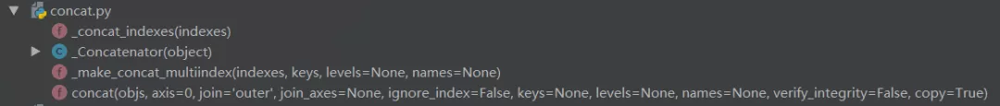
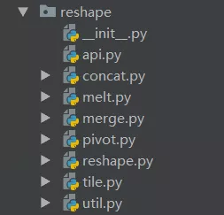
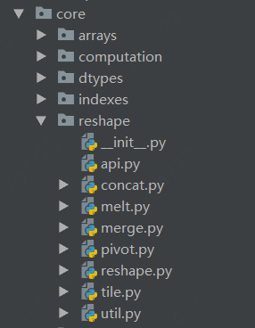

以下文章来源于Python与算法社区 ，作者zglg


来源：开源中国 [https://mp.weixin.qq.com/s/Rf_5PMjSeFbaZJ9rIcz2vg]

本文提纲

(基于前面的推送，汇总成此文)

### 1、静态/动态OR强类型/弱类型

静态类型 vs 动态 编程语言

强类型 vs 弱类型 编程语言

#### 1.1 类型检查

类型检查是一个验证和施加类型约束的过程，编译器或解释器通常在编译或运行阶段做类型检查。例如，你不能拿一个string类型值除以浮点数。

用更简单的术语，类型检查仅仅就是查看变量和它们的类型，然后说这个表达式是合理的。

因此，现在我们知道类型检查是什么，明白这些术语真的很简单。

在静态类型语言(statically typed languages)中，类型检查发生在编译阶段(compile time)，然而，在动态类型语言(dynamically typed languages)中，类型检查发生在运行阶段(run time)

#### 1.2  它意味着什么？

1.2.1 类型声明

静态类型(static): 所有的变量类型必须被显示地声明，因为这些信息在编译阶段就被需要。例如，在 Java 中

float f = 0.5
动态(Dynamic): 显示声明不被要求，因为类型赋值发生在运行阶段。例如在 Python 中，

f = 0.5
1.2.2 性能

静态类型(static): 编译阶段做更多处理，但是运行时(run-time)性能更好

动态(Dynamic): 编译阶段更高效，但是运行时的类型检查会影响到性能

1.2.3 灵活性和出错

静态类型:  运行时出错机会更小，但是提供给程序员的灵活性不好

动态类型: 提供更多的灵活性但是运行时出错机会相对更大

1.2.4 记住
各种语言按照动态/静态，弱类型/强类型的划分：

==> Statically type-checked languages.

==> Dynamically type-checked languages.

#### 1.3 什么是强类型/弱类型？

首先看下什么是强类型，在强类型中，不管在编译时还是运行时，一旦某个类型赋值给某个变量，它会持有这个类型，并且不能同其他类型在计算某个表达式时混合计算。例如在Python中：

data = 5 # 在runtime时，被赋值为整形

data = data + "xiaoming" # error

然而，在弱类型中，它是很容易与其他类型混合计算的，比如同样一门伟大的语言 Javascript，使用它：

```
a = 5
data = data + 'xiaoming' //string和int可以结合
```

#### 1.4  结论

类型检查确保一个表达式中的变量类型是合法的。在静态类型语言中，类型检查发生在编译阶段；动态类型语言，类型检查发生在运行阶段。

强类型语言有更强的类型检查机制，表达式计算中会做严格的类型检查；而弱类型语言允许各种变量类型间做一些运算。

### 2、内置函数(63个)

1 abs()

绝对值或复数的模

```
In [1]: abs(-6)
Out[1]: 6
```
2 all()　　

接受一个迭代器，如果迭代器的所有元素都为真，那么返回True，否则返回False
```
In [2]: all([1,0,3,6])
Out[2]: False

In [3]: all([1,2,3])
Out[3]: True
```
3 any()　　

接受一个迭代器，如果迭代器里有一个元素为真，那么返回True，否则返回False
```
In [4]: any([0,0,0,[]])
Out[4]: False

In [5]: any([0,0,1])
Out[5]: True
```
4、ascii()　　

调用对象的repr() 方法，获得该方法的返回值
```
In [30]: class Student():
    ...:     def __init__(self,id,name):
    ...:         self.id = id
    ...:         self.name = name
    ...:     def __repr__(self):
    ...:         return 'id = '+self.id +', name = '+self.name

In [33]: print(xiaoming)
id = 001, name = xiaoming

In [34]: ascii(xiaoming)
Out[34]: 'id = 001, name = xiaoming'
```
5、 bin()

将十进制转换为二进制
```
In [35]: bin(10)
Out[35]: '0b1010'
6 oct()
```
将十进制转换为八进制
```
In [36]: oct(9)
Out[36]: '0o11'
```
7 hex()

将十进制转换为十六进制
```
In [37]: hex(15)
Out[37]: '0xf'
```
8 bool()　　

测试一个对象是True, 还是False.
```
In [38]: bool([0,0,0])
Out[38]: True

In [39]: bool([])
Out[39]: False

In [40]: bool([1,0,1])
Out[40]: True
```
9 bytes()　　

将一个字符串转换成字节类型
```
In [44]: s = "apple"

In [45]: bytes(s,encoding='utf-8')
Out[45]: b'apple'
```
10 str()　　

将字符类型、数值类型等转换为字符串类型
```
In [46]: integ = 100

In [47]: str(integ)
Out[47]: '100'
```
11 callable()　　

判断对象是否可以被调用，能被调用的对象就是一个callable 对象，比如函数 str, int 等都是可被调用的，但是例子4 中xiaoming这个实例是不可被调用的：
```
In [48]: callable(str)
Out[48]: True

In [49]: callable(int)
Out[49]: True

In [50]: xiaoming
Out[50]: id = 001, name = xiaoming

In [51]: callable(xiaoming)
Out[51]: False
```
12 chr()

查看十进制整数对应的ASCII字符
```
In [54]: chr(65)
Out[54]: 'A'
```
13 ord()

查看某个ascii对应的十进制数
```
In [60]: ord('A')
Out[60]: 65
```
14 classmethod()　　

classmethod 修饰符对应的函数不需要实例化，不需要 self 参数，但第一个参数需要是表示自身类的 cls 参数，可以来调用类的属性，类的方法，实例化对象等。
```
In [66]: class Student():
    ...:     def __init__(self,id,name):
    ...:         self.id = id
    ...:         self.name = name
    ...:     def __repr__(self):
    ...:         return 'id = '+self.id +', name = '+self.name
    ...:     @classmethod
    ...:     def f(cls):
    ...:         print(cls)
```
15 complie()　　

将字符串编译成python 能识别或可以执行的代码，也可以将文字读成字符串再编译。
```
In [74]: s  = "print('helloworld')"

In [75]: r = compile(s,"<string>", "exec")

In [76]: r
Out[76]: <code object <module> at 0x0000000005DE75D0, file "<string>", line 1>

In [77]: exec(r)
helloworld
```
16  complex()

创建一个复数
```
In [81]: complex(1,2)
Out[81]: (1+2j)
```

17 delattr()　　

删除对象的属性
```
In [87]: delattr(xiaoming,'id')

In [88]: hasattr(xiaoming,'id')
Out[88]: False
```
18 dict()　　

创建数据字典
```
In [92]: dict()
Out[92]: {}

In [93]: dict(a='a',b='b')
Out[93]: {'a': 'a', 'b': 'b'}

In [94]: dict(zip(['a','b'],[1,2]))
Out[94]: {'a': 1, 'b': 2}

In [95]: dict([('a',1),('b',2)])
Out[95]: {'a': 1, 'b': 2}
```

19 dir()　　

不带参数时返回当前范围内的变量，方法和定义的类型列表；带参数时返回参数的属性，方法列表。
```
In [96]: dir(xiaoming)
Out[96]:
['__class__',
 '__delattr__',
 '__dict__',
 '__dir__',
 '__doc__',
 '__eq__',
 '__format__',
 '__ge__',
 '__getattribute__',
 '__gt__',
 '__hash__',
 '__init__',
 '__init_subclass__',
 '__le__',
 '__lt__',
 '__module__',
 '__ne__',
 '__new__',
 '__reduce__',
 '__reduce_ex__',
 '__repr__',
 '__setattr__',
 '__sizeof__',
 '__str__',
 '__subclasshook__',
 '__weakref__',

 'name']
```
20 divmod()　　

分别取商和余数
```
In [97]: divmod(10,3)
Out[97]: (3, 1)
```
21 enumerate()　　

返回一个可以枚举的对象，该对象的next()方法将返回一个元组。

```
In [98]: s = ["a","b","c"]
    ...: for i ,v in enumerate(s,1):
    ...:     print(i,v)
    ...:
1 a
2 b
3 c
22 eval()　　
```

将字符串str 当成有效的表达式来求值并返回计算结果取出字符串中内容
```
In [99]: s = "1 + 3 +5"
    ...: eval(s)
    ...:
Out[99]: 9
```
23 exec()　　

执行字符串或complie方法编译过的字符串，没有返回值
```
In [74]: s  = "print('helloworld')"

In [75]: r = compile(s,"<string>", "exec")

In [76]: r
Out[76]: <code object <module> at 0x0000000005DE75D0, file "<string>", line 1>

In [77]: exec(r)
helloworld
```
24 filter()　　

过滤器，构造一个序列，等价于
```
[ item for item in iterables if function(item)]
在函数中设定过滤条件，逐一循环迭代器中的元素，将返回值为True时的元素留下，形成一个filter类型数据。

In [101]: fil = filter(lambda x: x>10,[1,11,2,45,7,6,13])

In [102]: list(fil)
Out[102]: [11, 45, 13]
```
25 float()　　

将一个字符串或整数转换为浮点数
```
In [103]: float(3)
Out[103]: 3.0
```
26 format()　　

格式化输出字符串，format(value, format_spec)实质上是调用了value的format(format_spec)方法。
```
In [104]: print("i am {0},age{1}".format("tom",18))
i am tom,age18
```
27 frozenset()　　

创建一个不可修改的集合。
```
In [105]: frozenset([1,1,3,2,3])
Out[105]: frozenset({1, 2, 3})
```
28 getattr()　　

获取对象的属性
```
In [106]: getattr(xiaoming,'name')
Out[106]: 'xiaoming'
```
29 globals()　　

返回一个描述当前全局变量的字典

30 hasattr()
```
In [110]: hasattr(xiaoming,'name')
Out[110]: True

In [111]: hasattr(xiaoming,'id')
Out[111]: False
```
31 hash()　　

返回对象的哈希值
```
In [112]: hash(xiaoming)
Out[112]: 6139638
```
32 help()　　

返回对象的帮助文档
```
In [113]: help(xiaoming)
Help on Student in module __main__ object:

class Student(builtins.object)
 |  Methods defined here:
 |
 |  __init__(self, id, name)
 |
 |  __repr__(self)
 |
 |  ----------------------------------------------------------------------
 |  Data descriptors defined here:
 |
 |  __dict__
 |      dictionary for instance variables (if defined)
 |
 |  __weakref__
 |      list of weak references to the object (if defined)
```
33 id()　　

返回对象的内存地址
```
In [115]: id(xiaoming)
Out[115]: 98234208
```
34 input()　　

获取用户输入内容
```
In [116]: input()
aa
Out[116]: 'aa'
```
35  int()　　

int(x, base =10) , x可能为字符串或数值，将x 转换为一个普通整数。如果参数是字符串，那么它可能包含符号和小数点。如果超出了普通整数的表示范围，一个长整数被返回。
```
In [120]: int('12',16)
Out[120]: 18
```
36  isinstance(object, classinfo)

判断object是否为类classinfo的实例，是返回true
```
In [20]: class Student():
    ...:     ...:     def __init__(self,id,name):
    ...:     ...:         self.id = id
    ...:     ...:         self.name = name
    ...:     ...:     def __repr__(self):
    ...:     ...:         return 'id = '+self.id +', name = '+self.name
    ...:

In [21]: xiaoming = Student('001','xiaoming')

In [22]: isinstance(xiaoming,Student)
Out[22]: True
```
37 issubclass(class, classinfo)

如果class是classinfo类的子类，返回True：
```
In [27]: class undergraduate(Student):
    ...:     def studyClass(self):
    ...:         pass
    ...:     def attendActivity(self):
    ...:         pass
    ...:

In [28]: issubclass(undergraduate,Student)
Out[28]: True

In [29]: issubclass(object,Student)
Out[29]: False

In [30]: issubclass(Student,object)
Out[30]: True
如果class是classinfo元组中某个元素的子类，也会返回True

In [26]: issubclass(int,(int,float))
Out[26]: True
```
38 iter(object, sentinel)

返回一个可迭代对象, sentinel可省略
```
In [72]: lst = [1,3,5]

In [73]: for i in iter(lst):
    ...:     print(i)
    ...:
1
3
5
```
sentinel 理解为迭代对象的哨兵，一旦迭代到此元素，立即终止：
```
In [81]: class TestIter(object):
    ...:         def __init__(self):
    ...:             self.l=[1,3,2,3,4,5]
    ...:             self.i=iter(self.l)
    ...:         def __call__(self):  #定义了__call__方法的类的实例是可调用的
    ...:             item = next(self.i)
    ...:             print ("__call__ is called,which would return",item)
    ...:             return item
    ...:         def __iter__(self): #支持迭代协议(即定义有__iter__()函数)
    ...:             print ("__iter__ is called!!")
    ...:             return iter(self.l)
    ...:

In [82]:     t = TestIter()
    ...:     t1 = iter(t, 3)
    ...:     for i in t1:
    ...:         print(i)
    ...:
__call__ is called,which would return 1
1
__call__ is called,which would return 3
```
39 len(s)

返回对象的长度（元素个数）
```
In [83]: dic = {'a':1,'b':3}

In [84]: len(dic)
Out[84]: 2
40 list([iterable])
```
返回可变序列类型
```
In [85]: list(map(lambda x: x%2==1, [1,3,2,4,1]))
Out[85]: [True, True, False, False, True]
```
41 map(function, iterable, …)

返回一个将 function 应用于 iterable 中每一项并输出其结果的迭代器：
```
In [85]: list(map(lambda x: x%2==1, [1,3,2,4,1]))
Out[85]: [True, True, False, False, True]
```
可以传入多个iterable对象，输出长度等于最短序列的长度：
```
In [88]: list(map(lambda x,y: x%2==1 and y%2==0, [1,3,2,4,1],[3,2,1,2]))
Out[88]: [False, True, False, False]
```
42 max(iterable,*[, key, default])

返回最大值：
```
In [99]: max(3,1,4,2,1)
Out[99]: 4

In [100]: max((),default=0)
Out[100]: 0

In [89]: di = {'a':3,'b1':1,'c':4}
In [90]: max(di)
Out[90]: 'c'

In [102]: a = [{'name':'xiaoming','age':18,'gender':'male'},{'name':'
     ...: xiaohong','age':20,'gender':'female'}]
In [104]: max(a,key=lambda x: x['age'])
Out[104]: {'name': 'xiaohong', 'age': 20, 'gender': 'female'}
```
43 min(iterable,*[, key, default])

返回最小值

44 memoryview(obj)

返回由给定实参创建的“内存视图”对象， Python 代码访问一个对象的内部数据，只要该对象支持 缓冲区协议 而无需进行拷贝

45 next(iterator,[, default])

返回可迭代对象的下一个元素
```
In [129]: it = iter([5,3,4,1])

In [130]: next(it)
Out[130]: 5

In [131]: next(it)
Out[131]: 3

In [132]: next(it)
Out[132]: 4

In [133]: next(it)
Out[133]: 1

In [134]: next(it,0) #迭代到头，默认返回值为0
Out[134]: 0

In [135]: next(it)
----------------------------------------------------------------------
StopIteration                        Traceback (most recent call last)
<ipython-input-135-bc1ab118995a> in <module>
----> 1 next(it)

StopIteration:
```
46 object()

返回一个没有特征的新对象。object 是所有类的基类。
```
In [137]: o = object()

In [138]: type(o)
Out[138]: object
```
47 open(file)

返回文件对象
```
In [146]: fo = open('D:/a.txt',mode='r', encoding='utf-8')

In [147]: fo.read()
Out[147]: '\ufefflife is not so long,\nI use Python to play.'
mode取值表：

字符	意义
'r'	读取（默认）
'w'	写入，并先截断文件
'x'	排它性创建，如果文件已存在则失败
'a'	写入，如果文件存在则在末尾追加
'b'	二进制模式
't'	文本模式（默认）
'+'	打开用于更新（读取与写入）
```
48 pow(base, exp[, mod])

base为底的exp次幂，如果mod给出，取余
```
In [149]: pow(3, 2, 4)
Out[149]: 1
```
49 print(objects)

打印对象，此函数不解释

50 class property(fget=None, fset=None, fdel=None, doc=None)

返回 property 属性，典型的用法：
```
class C:
    def __init__(self):
        self._x = None

    def getx(self):
        return self._x

    def setx(self, value):
        self._x = value

    def delx(self):
        del self._x
    # 使用property类创建 property 属性
    x = property(getx, setx, delx, "I'm the 'x' property.")
```
使用python装饰器，实现与上完全一样的效果代码：
```
class C:
    def __init__(self):
        self._x = None

    @property
    def x(self):
        return self._x

    @x.setter
    def x(self, value):
        self._x = value

    @x.deleter
    def x(self):
        del self._x
```
51 range(stop)

range(start, stop[,step])

生成一个不可变序列：
```
In [153]: range(11)
Out[153]: range(0, 11)

In [154]: range(0,11,1)
Out[154]: range(0, 11)
```
52 reversed(seq)

返回一个反向的 iterator:
```
In [155]: rev = reversed([1,4,2,3,1])

In [156]: for i in rev:
     ...:     print(i)
     ...:
1
3
2
4
1
53 round(number[, ndigits])
```
四舍五入，ndigits代表小数点后保留几位：
```
In [157]: round(10.0222222, 3)
Out[157]: 10.022
```
54 class set([iterable])

返回一个set对象，可实现去重：
```
In [159]: a = [1,4,2,3,1]

In [160]: set(a)
Out[160]: {1, 2, 3, 4}
```
55 class slice(stop)

class slice(start, stop[, step])

返回一个表示由 range(start, stop, step) 所指定索引集的 slice对象
```
In [170]: a = [1,4,2,3,1]

In [171]: a[slice(0,5,2)] #等价于a[0:5:2]
Out[171]: [1, 2, 1]
```
56 sorted(iterable, *, key=None, reverse=False)

排序：
```
In [174]: a = [1,4,2,3,1]

In [175]: sorted(a,reverse=True)
Out[175]: [4, 3, 2, 1, 1]

In [178]: a = [{'name':'xiaoming','age':18,'gender':'male'},{'name':'
     ...: xiaohong','age':20,'gender':'female'}]
In [180]: sorted(a,key=lambda x: x['age'],reverse=False)
Out[180]:
[{'name': 'xiaoming', 'age': 18, 'gender': 'male'},
 {'name': 'xiaohong', 'age': 20, 'gender': 'female'}]
```
57 @`staticmethod

将方法转换为静态方法，不做解释

58 vars()

返回模块、类、实例或任何其它具有 __dict__属性的对象的 __dict__ 属性
```
In [2]: vars()
Out[2]:
{'__name__': '__main__',
 '__doc__': 'Automatically created module for IPython interactive environment',
 '__package__': None,
 '__loader__': None,
 '__spec__': None,
 '__builtin__': <module 'builtins' (built-in)>,
 '__builtins__': <module 'builtins' (built-in)>,
 '_ih': ['', 'vars([1,2,3])', 'vars()'],
 '_oh': {},
 '_dh': ['C:\\Windows\\system32'],
 'In': ['', 'vars([1,2,3])', 'vars()'],
 'Out': {},
 'get_ipython': <bound method InteractiveShell.get_ipython of <IPython.terminal.interactiveshell.TerminalInteractiveShell object at 0x0000026004D91C50>>,
 'exit': <IPython.core.autocall.ExitAutocall at 0x26006011048>,
 'quit': <IPython.core.autocall.ExitAutocall at 0x26006011048>,
 '_': '',
 '__': '',
 '___': '',
 '_i': 'vars([1,2,3])',
 '_ii': '',
 '_iii': '',
 '_i1': 'vars([1,2,3])',
 '_i2': 'vars()'}
```
59 sum(iterable, /, start=0)

求和：
```
In [181]: a = [1,4,2,3,1]

In [182]: sum(a)
Out[182]: 11

In [185]: sum(a,10) #求和的初始值为10
Out[185]: 21
```
60 super([type[, object-or-type]])

返回一个代理对象，它会将方法调用委托给 type 的父类或兄弟类

61 tuple([iterable])

虽然被称为函数，但 tuple 实际上是一个不可变的序列类型

62 class type(object)

class type(name, bases, dict)

传入一个参数时，返回 object 的类型：
```
In [186]: type(xiaoming)
Out[186]: __main__.Student

In [187]: type(tuple())
Out[187]: tuple
```
63 zip(*iterables)

创建一个聚合了来自每个可迭代对象中的元素的迭代器：
```
In [188]: x = [3,2,1]
In [189]: y = [4,5,6]
In [190]: list(zip(y,x))
Out[190]: [(4, 3), (5, 2), (6, 1)]

In [191]: a = range(5)
In [192]: b = list('abcde')
In [193]: b
Out[193]: ['a', 'b', 'c', 'd', 'e']
In [194]: [str(y) + str(x) for x,y in zip(a,b)]
Out[194]: ['a0', 'b1', 'c2', 'd3', 'e4']
```

### 3 列表生成式
python里面[] 表示一个列表，对容器类型的数据进行运算和操作，生成新的列表最高效、快速的办法，就是列表生成式。它优雅、简洁，值得大家多多使用！今天盘点列表生成式在工作中的主要使用场景。

3.1 入门例子

1 range快速生成连续列表
```
In [1]: a = range(11)

In [2]: a
Out[2]: range(0, 11)

In [3]: list(a)
Out[3]: [0, 1, 2, 3, 4, 5, 6, 7, 8, 9, 10]
```

2 对列表里面的数据进行运算后重新生成一个新的列表：

```
In [5]: a = range(0,11)

In [6]: b = [x**2 for x in a]

In [7]: b
Out[7]: [0, 1, 4, 9, 16, 25, 36, 49, 64, 81, 100]
```
3 对一个列表里面的数据筛选，只计算[0,11) 中偶数的平方：
```
In [10]: a = range(11)

In [11]: c = [x**2 for x in a if x%2==0]

In [12]: c
Out[12]: [0, 4, 16, 36, 64, 100]
```
4 前面列表生成式都只传一个参数x，带有两个参数的运算：
```
In [13]: a = range(5)

In [14]: b = ['a','b','c','d','e']
In [20]: c = [str(y) + str(x) for x, y in zip(a,b)]
In [21]: c
Out[21]: ['a0', 'b1', 'c2', 'd3', 'e4']
```
3.2 中级例子

5  结合字典，打印键值对：
```
In [22]: a = {'a':1,'b':2,'c':3}
In [23]: b = [k+ '=' + v for k, v in a.items()]
In [24]: b = [k+ '=' + str(v) for k, v in a.items()]
In [25]: b
Out[25]: ['a=1', 'b=2', 'c=3']
```
6 输出某个目录下的所有文件和文件夹的名称：
```
In [33]: [d for d in os.listdir('d:/summary')]
Out[33]: ['a.txt.txt', 'python-100']
```
7 列表中所有单词都转化为小写：
```
In [34]: a = ['Hello', 'World', '2019Python']

In [35]: [w.lower() for w in a]
Out[35]: ['hello', 'world', '2019python']
```

3.3 高级例子

8 将值分组：
```
In [36]: def bifurcate(lst, filter):
    ...:   return [
    ...:     [x for i,x in enumerate(lst) if filter[i] == True],
    ...:     [x for i,x in enumerate(lst) if filter[i] == False]
    ...:   ]
    ...:
In [37]: bifurcate(['beep', 'boop', 'foo', 'bar'], [True, True, False, True])

Out[37]: [['beep', 'boop', 'bar'], ['foo']]
```

9 进一步抽象例子8，根据指定函数fn 对lst 分组：
```
In [38]: def bifurcate_by(lst, fn):
    ...:   return [
    ...:     [x for x in lst if fn(x)],
    ...:     [x for x in lst if not fn(x)]
    ...:   ]
    ...:

In [39]: bifurcate_by(['beep', 'boop', 'foo', 'bar'], lambda x: x[0] == 'b')
Out[39]: [['beep', 'boop', 'bar'], ['foo']]
```

10 返回可迭代对象的差集，注意首先都把a, b用set 包装
```
In [53]: def difference(a, b):
    ...:   _a, _b =set(a),set(b)
    ...:   return [item for item in _a if item not in _b]
    ...:
    ...:

In [54]: difference([1,1,2,3,3], [1, 2, 4])
Out[54]: [3]
```

11 进一步抽象10，根据函数fn 映射后选取差集，如下列表元素分别为单个元素和字典的例子：
```
In [61]: def difference_by(a, b, fn):
    ...:     ...:   _b = set(map(fn, b))
    ...:     ...:   return [item for item in a if fn(item) not in _b]
    ...:     ...:
    ...:

In [62]: from math import floor
    ...: difference_by([2.1, 1.2], [2.3, 3.4],floor)
Out[62]: [1.2]

In [63]: difference_by([{ 'x': 2 }, { 'x': 1 }], [{ 'x': 1 }], lambda v : v['x'])
Out[63]: [{'x': 2}]
```

12 过滤非重复值，结合list 的count( 统计出元素在列表中出现次数)：
```
In [64]: def filter_non_unique(lst):
    ...:   return [item for item in lst if lst.count(item) == 1]

In [65]: filter_non_unique([1, 2, 2, 3, 4, 4, 5])
Out[65]: [1, 3, 5]
```
### 4 Collections
Python有许多很好的库(libraries)，实现这些功能只需要几行代码。今天介绍一个库：collections. 这个模块提供容器相关的更高性能的数据类型，它们提供比通用容器 dict, list, set 和tuple更强大的功能。

今天介绍其中三种数据类型，最后你可能会惊讶它们怎么这么好用。

4.1 NamedTuple
对于数据分析或机器学习领域，用好namedtuples 会写出可读性强、易于维护的代码。大家回忆这种熟悉的场景，你正在做特征工程，因为你尤其喜爱list, 所以把一堆特征放到一个list 中，然后喂到机器学习模型中。很快，你将会意识到数百个特征位于此list 中，这就是事情变得糟糕的开始。
```
In [10]: feature = ['age','height','name']

In [11]: data = [[10,1,'xiaoming'],[12,1,5,'xiaohong']]

In [12]: data[0][0] #只能靠整数索引到某个特征，0对应age
Out[12]: 10
```
某天，你想使用某个特征，这时比较棘手，你不知道它的index！更糟糕的是，当你准备离职要交接工作时，他们看到一个一个的数字型索引，完全对不上哪个和哪个，他们懵逼，你也尴尬。

如果我们使用NamedTuples去处理以上数据，乱为一团的事情将会迅速变得井然有序：
```
In [4]: Person = namedtuple('Person',['age','height','name'])
In [15]: data2 = [Person(10,1.4,'xiaoming'),Person(12,1.5,'xiaohong')]
In [16]: data2[0].age
Out[16]: 10
```
仅仅几行代码，我们将会很容易索引到第0行数据的age属性取值，这在实际中真是太好用。你告别indexes访问你的数据集中的特征值，而是使用更加人性化，可读性强的names索引。

NamedTuples会使得代码易读、更易维护。

4.2 Counter
Counter正如名字那样，它的主要功能就是计数。这听起来简单，但是我们在分析数据时，基本都会涉及计数，真的家常便饭。

习惯使用list 的看过来，有一些数值已经放在一个list中：
```
skuPurchaseCount = [3, 8, 3, 10, 3, 3, 1, 3, 7, 6, 1, 2, 7, 0, 7, 9, 1, 5, 1, 0]
In [33]: for i in skuPurchaseCount:
    ...:     if countdict.get(i) is None:
    ...:         countdict[i]=1
    ...:     else:
    ...:         countdict[i]+=1
In [34]: countdict
Out[34]: {3: 5, 8: 1, 10: 1, 1: 4, 7: 3, 6: 1, 2: 1, 0: 2, 9: 1, 5: 1}
```
如果使用Counter，我们可以写出更简化的代码：
```
In [35]: from collections import Counter
In [42]: Counter(skuPurchaseCount).most_common()
Out[42]:
[(3, 5),(1, 4),(7, 3),(0, 2),(8, 1),(10, 1),(6, 1),(2, 1),(9, 1),(5, 1)]
```
仅仅一行代码，我们便输出统计计数结果，并且是一个按照次数统计出来的由大到小排序好的tuples列表，因此我们很快就会看到，购买3次是出现最多的，一共5次。

购买为1次的占多数，属于长尾。

4.3 DefaultDict
DefaultDict是一个被初始化的字典，也就是每个键都已经被访问一次：
```
In [53]: d = defaultdict(int)
In [54]: for k in 'collections':
    ...:     d[k] += 1
In [55]: d
Out[55]:
defaultdict(int,
            {'c': 2, 'o': 2, 'l': 2, 'e': 1, 't': 1, 'i': 1, 'n': 1, 's': 1})
```
一般地，当你尝试访问一个不在字典中的值时，将会抛出一个异常。但是defaultdict可以帮助我们初始化，它的参数作为default_factory. 在上面例子中，将生成 int对象，意思是默认值为int 型，并设定初始值为0，所以我们可以很容易地统计每个字符出现的次数。

Simple and clean!

更有用的一个使用场景，我们有很多种商品，在每秒内下单次数的统计数据如下：
```
In [56]: data = [('iphone11',103), ('华为macbook-SKU1232',210),('iphone11',21),('
    ...: 华为macbook-SKU1232',100)]
In [57]: d = defaultdict(list)
In [58]: for ele in data:
    ...:     d[ele[0]].append(ele[1])
In [59]: d
Out[59]: defaultdict(list, {'iphone11': [103, 21], '华为macbook-SKU1232': [210, 100]})
```
上面例子default_dict取值为list, 因此，我们可以立即append一个元素到list中，更简洁。

总结

至此，你已经了解collections库中的三个类型，它们确实太好用，大家可以操练起来了！

### 5 itertools: 高效节省内存的方法
Python循环这样写，高效节省内存100倍

5.0 前言

说到处理循环，我们习惯使用for, while等，比如依次打印每个列表中的字符：
```
lis = ['I', 'love', 'python']
for i in lis:
    print(i)
I
love
python
```

在打印内容字节数较小时，全部载入内存后，再打印，没有问题。可是，如果现在有成千上百万条车辆行驶轨迹，叫你分析出其中每个客户的出行规律，堵车情况等，假如是在单机上处理这件事。

你可能首先要面临，也可能被你忽视，最后代码都写好后，才可能暴露出的一个问题:outofmemory, 这在实际项目中经常遇到。

这个问题提醒我们，处理数据时，如何写出高效利用内存的程序，就显得很重要。今天，我们就来探讨如何高效利用内存，节省内存同时还能把事情办好。

其实，Python已经准备好一个模块专门用来处理这件事，它就是 itertools 模块，这里面几个函数的功能其实很好理解。

我不打算笼统的介绍它们所能实现的功能，而是想分析这些功能背后的实现代码，它们如何做到高效节省内存的，Python内核的贡献者们又是如何写出一手漂亮的代码的，这很有趣，不是吗？

OK，let's go. Hope you enjoy the journey!

5.1 拼接元素

itertools 中的chain 函数实现元素拼接，原型如下，参数*表示个数可变的参数

chain(iterables)

应用如下：
```
In [33]: list(chain(['I','love'],['python'],['very', 'much']))
Out[33]: ['I', 'love', 'python', 'very', 'much']
```

哇，不能再好用了，它有点join的味道，但是比join强，它的重点在于参数都是可迭代的实例。

那么，chain如何实现高效节省内存的呢？chain大概的实现代码如下：
```
def chain(*iterables):
    for it in iterables:
        for element in it:
            yield element
```
以上代码不难理解，chain本质返回一个生成器，所以它实际上是一次读入一个元素到内存，所以做到最高效地节省内存。

5.2 逐个累积

返回列表的累积汇总值，原型：

accumulate(iterable[, func, *, initial=None])

应用如下：
```
In [36]: list(accumulate([1,2,3,4,5,6],lambda x,y: x*y))
Out[36]: [1, 2, 6, 24, 120, 720]
```
accumulate大概的实现代码如下：
```
def accumulate(iterable, func=operator.add, *, initial=None):
    it = iter(iterable)
    total = initial
    if initial is None:
        try:
            total = next(it)
        except StopIteration:
            return
    yield total
    for element in it:
        total = func(total, element)
        yield total
```
以上代码，你还好吗？与chain简单的yield不同，此处稍微复杂一点，yield有点像return，所以 yield total那行直接就返回一个元素，也就是iterable的第一个元素，因为任何时候这个函数返回的第一个元素就是它的第一个。又因为yield返回的是一个generator对象，比如名字gen，所以next(gen)时，代码将会执行到 for element in it:这行，而此时的迭代器it 已经指到iterable的第二个元素，OK，相信你懂了！

5.3 漏斗筛选

它是compress 函数，功能类似于漏斗功能，所以我称它为漏斗筛选，原型：

compress(data, selectors)
```
In [38]: list(compress('abcdefg',[1,1,0,1]))
Out[38]: ['a', 'b', 'd']
```
容易看出，compress返回的元素个数等于两个参数中较短的列表长度。

它的大概实现代码：
```
def compress(data, selectors):
    return (d for d, s in zip(data, selectors) if s)
```
这个函数非常好用

5.4 段位筛选

扫描列表，不满足条件处开始往后保留，原型如下：

dropwhile(predicate, iterable)

应用例子：
```
In [39]: list(dropwhile(lambda x: x<3,[1,0,2,4,1,1,3,5,-5]))
Out[39]: [4, 1, 1, 3, 5, -5]
```
实现它的大概代码如下：
```
def dropwhile(predicate, iterable):
    iterable = iter(iterable)
    for x in iterable:
        if not predicate(x):
            yield x
            break
    for x in iterable:
        yield x
```

5.5 段位筛选2

扫描列表，只要满足条件就从可迭代对象中返回元素，直到不满足条件为止，原型如下：

takewhile(predicate, iterable)

应用例子：
```
In [43]: list(takewhile(lambda x: x<5, [1,4,6,4,1]))
Out[43]: [1, 4]
```
实现它的大概代码如下：
```
def takewhile(predicate, iterable):
    for x in iterable:
        if predicate(x):
            yield x
        else:
            break #立即返回
```
5.6 次品筛选

扫描列表，只要不满足条件都保留，原型如下：

dropwhile(predicate, iterable)

应用例子：
```
In [40]: list(filterfalse(lambda x: x%2==0, [1,2,3,4,5,6]))
Out[40]: [1, 3, 5]
```
实现它的大概代码如下：
```
def dropwhile(predicate, iterable):
    iterable = iter(iterable)
    for x in iterable:
        if not predicate(x):
            yield x
            break
    for x in iterable:
        yield x
```
5.7 切片筛选

Python中的普通切片操作，比如：
```
lis = [1,3,2,1]
lis[:1]
```

它们的缺陷还是lis 必须全部载入内存，所以更节省内存的操作islice，原型如下：

islice(iterable, start, stop[, step])

应用例子：
```
In [41]: list(islice('abcdefg',1,4,2))
Out[41]: ['b', 'd']
```

实现它的大概代码如下：
```
def islice(iterable, *args):
    s = slice(*args)
    start, stop, step = s.start or 0, s.stop or sys.maxsize, s.step or 1
    it = iter(range(start, stop, step))
    try:
        nexti = next(it)
    except StopIteration:
        for i, element in zip(range(start), iterable):
            pass
        return
    try:
        for i, element in enumerate(iterable):
            if i == nexti:
                yield element
                nexti = next(it)
    except StopIteration:
        for i, element in zip(range(i + 1, stop), iterable):
            pass
```

巧妙利用生成器迭代结束时会抛出异常StopIteration，做一些边界处理的事情。

5.8 细胞分裂

tee函数类似于我们熟知的细胞分裂，它能复制原迭代器n个，原型如下：

tee(iterable, n=2)

应用如下，可以看出复制出的两个迭代器是独立的
```
a = tee([1,4,6,4,1],2)
In [51]: next(a[0])
Out[51]: 1

In [52]: next(a[1])
Out[52]: 1
```

实现它的代码大概如下：
```
def tee(iterable, n=2):
    it = iter(iterable)
    deques = [collections.deque() for i in range(n)]
    def gen(mydeque):
        while True:
            if not mydeque:            
                try:
                    newval = next(it)   
                except StopIteration:
                    return
                for d in deques:     
                    d.append(newval)
            yield mydeque.popleft()
    return tuple(gen(d) for d in deques)
```

tee 实现内部使用一个队列类型deques，起初生成空队列，向复制出来的每个队列中添加元素newval, 同时yield 当前被调用的mydeque中的最左元素。

5.9 map变体

starmap可以看做是map的变体，它能更加节省内存，同时iterable的元素必须也为可迭代对象，原型如下：

starmap(function, iterable)

应用它：
```
In [63]: list(starmap(lambda x,y: str(x)+'-'+str(y), [('a',1),('b',2),('c',3)]))
Out[63]: ['a-1', 'b-2', 'c-3']
```

starmap的实现细节如下：
```
def starmap(function, iterable):
    for args in iterable:
        yield function(*args)
```

5.10 复制元素

repeat实现复制元素n次，原型如下：

repeat(object[, times])

应用如下：
```
In [66]: list(repeat(6,3))
Out[66]: [6, 6, 6]

In [67]: list(repeat([1,2,3],2))
Out[67]: [[1, 2, 3], [1, 2, 3]]
```

它的实现细节大概如下：
```
def repeat(object, times=None):
    if times is None:# 如果times不设置，将一直repeat下去
        while True: 
            yield object
    else:
        for i in range(times):
            yield object
```
5.11 笛卡尔积

笛卡尔积实现的效果同下：

 ((x,y) for x in A for y in B)
所以，笛卡尔积的实现效果如下：
```
In [68]: list(product('ABCD', 'xy'))
Out[68]:
[('A', 'x'),
 ('A', 'y'),
 ('B', 'x'),
 ('B', 'y'),
 ('C', 'x'),
 ('C', 'y'),
 ('D', 'x'),
 ('D', 'y')]
```
它的实现细节：
```
def product(*args, repeat=1):
    pools = [tuple(pool) for pool in args] * repeat
    result = [[]]
    for pool in pools:
        result = [x+[y] for x in result for y in pool]
    for prod in result:
        yield tuple(prod)
```

5.12 加强版zip

组合值。若可迭代对象的长度未对齐，将根据 fillvalue 填充缺失值，注意：迭代持续到耗光最长的可迭代对象，效果如下：
```
In [69]: list(zip_longest('ABCD', 'xy', fillvalue='-'))
Out[69]: [('A', 'x'), ('B', 'y'), ('C', '-'), ('D', '-')]
```
它的实现细节：
```
def zip_longest(*args, fillvalue=None):
    iterators = [iter(it) for it in args]
    num_active = len(iterators)
    if not num_active:
        return
    while True:
        values = []
        for i, it in enumerate(iterators):
            try:
                value = next(it)
            except StopIteration:
                num_active -= 1
                if not num_active:
                    return
                iterators[i] = repeat(fillvalue)
                value = fillvalue
            values.append(value)
        yield tuple(values)
```
它里面使用repeat，也就是在可迭代对象的长度未对齐时，根据 fillvalue 填充缺失值。理解上面代码的关键是迭代器对象(iter)，next方法的特殊性：
```
In [74]: for i, it in enumerate([iter([1,2,3]),iter(['x','y'])]):
    ...:     print(next(it))
    #输出：
    1
    x
```
结合这个提示再理解上面代码，就不会吃力。

5.13 总结

Python的itertools模块提供的节省内存的高效迭代器，里面实现基本都借助于生成器，所以一方面了解这12个函数所实现的基本功能，同时也能加深对生成器(generator)的理解，为我们写出更加高效、简洁、漂亮的代码打下坚实基础。

### 6 模块

太好了，一分钟带你分清Python的模块、包和库

#### 6.1 模块

一个.py文件就称之为一个模块（Module），一个模块里可能会包含很多函数，函数命名时，尽量不要与内置函数名字冲突。

常见的内置函数见文章：

Pandas的concat.py模块如下：



里面包括3个函数和1个类

注意：

系统自带了sys模块，自己的模块就不可命名为sys.py，否则将无法导入系统自带的sys模块。检查方法是在Python交互环境执行import abc，若成功则说明系统存在此模块。

#### 6.2 包

包（Package）下有多个模块，如下为pandas 的reshape 包，里面包括多个.py 文件。



里面有一个.py文件比较特殊，也是每个包下必须包括的，它是__init__.py

__init__.py可以是空文件，在此处reshape包下的这个文件就是空的。当然，也可以有Python代码，因为__init__.py本身就是一个模块。模块__init__.py的模块名在此处就是reshape。

可以有多级层次的包结构。比如pandas的core包，含有如下的目录结构：



#### 6.3 库

库是指具有相关功能模块的集合。这也是Python的一大特色之一，即具有强大的标准库、第三方库以及自定义模块。

1. 标准库：python里那些自带的模块

2. 第三方库：就是由其他的第三方机构，发布的具有特定功能的模块。比如2018年最受欢迎的几个库：TensorFlow、pandas、scikit-learn、PyTorch、Matplotlib、Keras、NumPy、SciPy、Apache MXNet、Theano、Bokeh、XGBoost、Gensim、Scrapy、Caffe

3. 自定义模块：用户自己可以自行编写模块，然后使用。

导入模块与包都是通过import来导入的


