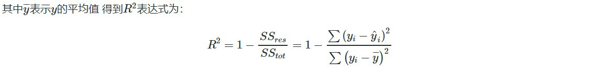
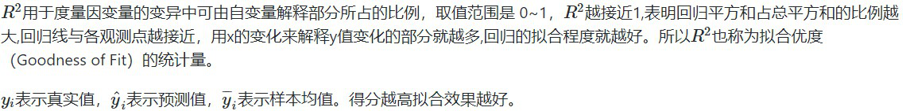

---
title:  TASK1 赛题数据
layout: post
tags: Tianchi
---


### 1 赛题理解究竟是理解什么？

* 理解问题背景，即数据的来源，实际用途背景资料。
	**如：对二手车数据的预测。**
```
1. 分析问题是否可行的方法，有多少可行度，赛题做的价值大不大 
2. 理清一道赛题要从背后的赛题背景引发的赛题任务理解其中的任务逻辑，可能对于赛题有意义的外在数据有哪些
3. 并对于赛题数据有一个初步了解，知道现在和任务的相关数据有哪些，其中数据之间的关联逻辑是什么样的。

```

* 理解问题类型，是回归分析问题，还是分类问题。
    **如：对二手车价格预测就是典型的回归问题**

* 理解问题类型的评价标准
```
评估指标即是我们对于一个模型效果的数值型量化。
（有点类似与对于一个商品评价打分，而这是针对于模型效果和理想效果之间的一个打分）
```
### 2 常见的评估标准有哪些？
* 分类问题常见的标准：
```
对于二类分类器/分类算法，评价指标主要有accuracy， [Precision，Recall，F-score，Pr曲线]，ROC-AUC曲线。
对于多类分类器/分类算法，评价指标主要有accuracy， [宏平均和微平均，F-score]。
```
* 对于回归预测类常见的评估指标如下:
```
1. 平均绝对误差（Mean Absolute Error，MAE）
2. 均方误差（Mean Squared Error，MSE）
3. 平均绝对百分误差（Mean Absolute Percentage Error，MAPE）
4. 均方根误差（Root Mean Squared Error）
5. R2（R-Square）
```

### 3 评估标准公式(主要 from sklearn import metrics)

* 平均绝对误差 平均绝对误差（Mean Absolute Error，MAE）:平均绝对误差，其能更好地反映预测值与真实值误差的实际情况，其计算公式如下：


* 均方误差 均方误差（Mean Squared Error，MSE）,均方误差,其计算公式为：

![https://github.com/HonorZheng/HonorZheng.github.io/blob/master/_posts/538caab00fed3ce0ae5f5139564953654bdc3d5a.png)

* R2（R-Square）的公式为： 残差平方和：


* 总平均值:






### 4 赛题分析

1. 此题为传统的数据挖掘问题，通过数据科学以及机器学习深度学习的办法来进行建模得到结果。
此题是一个典型的回归问题。
2. 主要应用xgb、lgb、catboost，以及pandas、numpy、matplotlib、seabon、sklearn、keras等等数据挖掘常用库或者框架来进行数据挖掘任务。
3. 通过EDA来挖掘数据的联系和自我熟悉数据。


* 读取数据
```
## 通过Pandas对于数据进行读取 (pandas是一个很友好的数据读取函数库)

Train_data = pd.read_csv('data/used_car_train_20200313.csv', sep=' ')
TestA_data = pd.read_csv('data/used_car_testA_20200313.csv', sep=' ')

## 输出数据的大小信息
print('Train data shape:',Train_data.shape)
print('TestA data shape:',TestA_data.shape)


>>> Train data shape: (150000, 31)
	TestA data shape: (50000, 30)
```

* 数据内容
```
## 通过.head() 简要浏览读取数据的形式
Train_data.head()
>>>
```
| SaleID | name | regDate | model    | brand | bodyType | fuelType | gearbox | power | kilometer | ...  | v_5 | v_6      | v_7      | v_8      | v_9      | v_10     | v_11      | v_12     | v_13      | v_14      |
| ------ | ---- | ------- | -------- | ----- | -------- | -------- | ------- | ----- | --------- | ---- | --- | -------- | -------- | -------- | -------- | -------- | --------- | -------- | --------- | --------- |
| 0      | 0    | 736     | 20040402 | 30.0  | 6        | 1.0      | 0.0     | 0.0   | 60        | 12.5 | ... | 0.235676 | 0.101988 | 0.129549 | 0.022816 | 0.097462 | -2.881803 | 2.804097 | -2.420821 | 0.795292  |
| 1      | 1    | 2262    | 20030301 | 40.0  | 1        | 2.0      | 0.0     | 0.0   | 0         | 15.0 | ... | 0.264777 | 0.121004 | 0.135731 | 0.026597 | 0.020582 | -4.900482 | 2.096338 | -1.030483 | -1.722674 |
| 2      | 2    | 14874   | 20040403 | 115.0 | 15       | 1.0      | 0.0     | 0.0   | 163       | 12.5 | ... | 0.251410 | 0.114912 | 0.165147 | 0.062173 | 0.027075 | -4.846749 | 1.803559 | 1.565330  | -0.832687 |
| 3      | 3    | 71865   | 19960908 | 109.0 | 10       | 0.0      | 0.0     | 1.0   | 193       | 15.0 | ... | 0.274293 | 0.110300 | 0.121964 | 0.033395 | 0.000000 | -4.509599 | 1.285940 | -0.501868 | -2.438353 |
| 4      | 4    | 111080  | 20120103 | 110.0 | 5        | 1.0      | 0.0     | 0.0   | 68        | 5.0  | ... | 0.228036 | 0.073205 | 0.091880 | 0.078819 | 0.121534 | -1.896240 | 0.910783 | 0.931110  | 2.834518  |


#### 4.1  分类评价指标

##### accuracy
```
import numpy as np
from sklearn.metrics import accuracy_score
y_pred = [0, 1, 0, 1]
y_true = [0, 1, 1, 1]
print('ACC:',accuracy_score(y_true, y_pred))
>>> ACC: 0.75

```

##### Precision,Recall,F1-score
```
from sklearn import metrics
y_pred = [0, 1, 0, 0]
y_true = [0, 1, 0, 1]
print('Precision',metrics.precision_score(y_true, y_pred))
print('Recall',metrics.recall_score(y_true, y_pred))
print('F1-score:',metrics.f1_score(y_true, y_pred))

>>> Precision 1.0
	Recall 0.5
	F1-score: 0.666666666667
```
#####  AUC
```
import numpy as np
from sklearn.metrics import roc_auc_score
y_true = np.array([0, 0, 1, 1])
y_scores = np.array([0.1, 0.4, 0.35, 0.8])
print('AUC socre:',roc_auc_score(y_true, y_scores))

>>> AUC socre: 0.75
```
#### 4.2 回归评价标准

#####  MSE,RMSE,MAE,MAPE
```
# coding=utf-8
import numpy as np
from sklearn import metrics

# MAPE需要自己实现
def mape(y_true, y_pred):
    return np.mean(np.abs((y_pred - y_true) / y_true))

y_true = np.array([1.0, 5.0, 4.0, 3.0, 2.0, 5.0, -3.0])
y_pred = np.array([1.0, 4.5, 3.8, 3.2, 3.0, 4.8, -2.2])

# MSE
print('MSE:',metrics.mean_squared_error(y_true, y_pred))
# RMSE
print('RMSE:',np.sqrt(metrics.mean_squared_error(y_true, y_pred)))
# MAE
print('MAE:',metrics.mean_absolute_error(y_true, y_pred))
# MAPE
print('MAPE:',mape(y_true, y_pred))

>>> MSE: 0.287142857143
	RMSE: 0.535857123815
	MAE: 0.414285714286
	MAPE: 0.14619047619
```
##### R2-score
```
from sklearn.metrics import r2_score
y_true = [3, -0.5, 2, 7]
y_pred = [2.5, 0.0, 2, 8]
print('R2-score:',r2_score(y_true, y_pred))

>>> R2-score: 0.948608137045
```