## 1. EDA 目标 (Exploratory Data Analysis)

1.EDA的价值主要在于熟悉数据集，**了解数据集**，对数据集进行验证来确定所获得数据集可以用于接下来的机器学习或者深度学习使用。

2.当了解了数据集之后我们下一步就是要去**了解变量间的相互关系以及变量与预测值之间的存在关系**。

3.**引导数据科学从业者进行数据处理以及特征工程**的步骤,使数据集的结构和特征集**让接下来的预测问题更加可靠**。

## 2. 内容及步骤
   
```
1.载入各种数据科学以及可视化库:
   数据科学库 pandas、numpy、scipy；
   可视化库 matplotlib、seabon；
   其他；
2.载入数据：
   载入训练集和测试集；
   简略观察数据(head()+shape)；
3.数据总览:
   通过 describe()来熟悉数据的相关统计量
   通过 info()来熟悉数据类型
4.判断数据缺失和异常
   查看每列的存在 nan 情况
   异常值检测
5.了解预测值的分布
   总体分布概况（无界约翰逊分布等）
   查看 skewness and kurtosis
   查看预测值的具体频数
6.特征分为类别特征和数字特征，并对类别特征查看 unique 分布
7.数字特征分析
   相关性分析
   查看几个特征得 偏度和峰值
   每个数字特征得分布可视化
   数字特征相互之间的关系可视化
   多变量互相回归关系可视化
8.类型特征分析
   unique 分布
   类别特征箱形图可视化
   类别特征的小提琴图可视化
   类别特征的柱形图可视化类别
   特征的每个类别频数可视化(count_plot)
9.用 pandas_profiling 生成数据报告
```

## 3. 代码实战
**1 载入包**

```
# 载入各种数据科学以及可视化库
#coding:utf-8 #导入 warnings 包，利用过滤器来实现忽略警告语句。
import warnings
warnings.filterwarnings('ignore')

import pandas as pd
import numpy as np
import matplotlib.pyplot as plt
import seaborn as sns
import missingno as msno
```

**2 载入数据**
```
# 载入数据
载入训练集和测试集；
path = './datalab/231784/'
Train_data = pd.read_csv(path+'used_car_train_20200313.csv', sep=' ')
Test_data = pd.read_csv(path+'used_car_testA_20200313.csv', sep=' ')

所有特征集均脱敏处理(方便大家观看)
name - 汽车编码
regDate - 汽车注册时间
model - 车型编码
brand - 品牌
bodyType - 车身类型
fuelType - 燃油类型
gearbox - 变速箱
power - 汽车功率
kilometer - 汽车行驶公里
notRepairedDamage - 汽车有尚未修复的损坏
regionCode - 看车地区编码
seller - 销售方
offerType - 报价类型
creatDate - 广告发布时间
price - 汽车价格
v_0', 'v_1', 'v_2', 'v_3', 'v_4', 'v_5', 'v_6', 'v_7', 'v_8', 'v_9', 'v_10', 'v_11', 'v_12', 'v_13','v_14' 【匿名特征，包含 v0-14 在内 15 个匿名特征】
```


**2. 简略观察数据(head()+shape)**
   
```
Train_data.head().append(Train_data.tail())
```

| SaleID | name   | regDate | model    | brand | bodyType | fuelType | gearbox | power | kilometer | ...  | v_5 | v_6      | v_7      | v_8      | v_9      | v_10     | v_11      | v_12      | v_13      | v_14      |
| ------ | ------ | ------- | -------- | ----- | -------- | -------- | ------- | ----- | --------- | ---- | --- | -------- | -------- | -------- | -------- | -------- | --------- | --------- | --------- | --------- |
| 0      | 0      | 736     | 20040402 | 30.0  | 6        | 1.0      | 0.0     | 0.0   | 60        | 12.5 | ... | 0.235676 | 0.101988 | 0.129549 | 0.022816 | 0.097462 | -2.881803 | 2.804097  | -2.420821 | 0.795292  |
| 1      | 1      | 2262    | 20030301 | 40.0  | 1        | 2.0      | 0.0     | 0.0   | 0         | 15.0 | ... | 0.264777 | 0.121004 | 0.135731 | 0.026597 | 0.020582 | -4.900482 | 2.096338  | -1.030483 | -1.722674 |
| 2      | 2      | 14874   | 20040403 | 115.0 | 15       | 1.0      | 0.0     | 0.0   | 163       | 12.5 | ... | 0.251410 | 0.114912 | 0.165147 | 0.062173 | 0.027075 | -4.846749 | 1.803559  | 1.565330  | -0.832687 |
| 3      | 3      | 71865   | 19960908 | 109.0 | 10       | 0.0      | 0.0     | 1.0   | 193       | 15.0 | ... | 0.274293 | 0.110300 | 0.121964 | 0.033395 | 0.000000 | -4.509599 | 1.285940  | -0.501868 | -2.438353 |
| 4      | 4      | 111080  | 20120103 | 110.0 | 5        | 1.0      | 0.0     | 0.0   | 68        | 5.0  | ... | 0.228036 | 0.073205 | 0.091880 | 0.078819 | 0.121534 | -1.896240 | 0.910783  | 0.931110  | 2.834518  |
| 149995 | 149995 | 163978  | 20000607 | 121.0 | 10       | 4.0      | 0.0     | 1.0   | 163       | 15.0 | ... | 0.280264 | 0.000310 | 0.048441 | 0.071158 | 0.019174 | 1.988114  | -2.983973 | 0.589167  | -1.304370 |
| 149996 | 149996 | 184535  | 20091102 | 116.0 | 11       | 0.0      | 0.0     | 0.0   | 125       | 10.0 | ... | 0.253217 | 0.000777 | 0.084079 | 0.099681 | 0.079371 | 1.839166  | -2.774615 | 2.553994  | 0.924196  |
| 149997 | 149997 | 147587  | 20101003 | 60.0  | 11       | 1.0      | 1.0     | 0.0   | 90        | 6.0  | ... | 0.233353 | 0.000705 | 0.118872 | 0.100118 | 0.097914 | 2.439812  | -1.630677 | 2.290197  | 1.891922  |
| 149998 | 149998 | 45907   | 20060312 | 34.0  | 10       | 3.0      | 1.0     | 0.0   | 156       | 15.0 | ... | 0.256369 | 0.000252 | 0.081479 | 0.083558 | 0.081498 | 2.075380  | -2.633719 | 1.414937  | 0.431981  |
| 149999 | 149999 | 177672  | 19990204 | 19.0  | 28       | 6.0      | 0.0     | 1.0   | 193       | 12.5 | ... | 0.284475 | 0.000000 | 0.040072 | 0.062543 | 0.025819 | 1.978453  | -3.179913 | 0.031724  | -1.483350 |
|        |        |         |          |       |          |          |         |       |           |      |     |          |          |          |          |          |           |           |           |           |

**目标**：要养成看数据集的 head()以及 shape 的习惯，这会让你每一步更放心，导致接下里的连串的错误, 如果对自己的 pandas 等操作不放心，建议执行一步看一下，这样会有效的方便你进行理解函数并进行操作<br>
  
**3. 总览数据概况(describe，info）**

   describe 中有每列的统计量，个数 count、平均值 mean、方差 std、最小值 min、中位数 25% 50% 75% 以及最大值 看这个信息主要是瞬间掌握数据的大概的范围以及每个值的异常值的判断，比如有的时候会发现 999 9999 -1 等值这些其实都是 nan 的另外一种表达方式，有的时候需要注意下<br>
   
   info 通过 info 来了解数据每列的 type，有助于了解是否存在除了 nan 以外的特殊符号异常
   
**3.1) 通过 .describe()来熟悉数据的相关统计量**

```
   Train_data.describe()
```

|          | SaleID        | name          | regDate      | model         | brand         | bodyType      | fuelType      | gearbox       | power         | kilometer     | ... | v_5           | v_6           | v_7           | v_8           | v_9           | v_10          | v_11          | v_12          | v_13          | v_14          |
| ----- | ------------- | ------------- | ------------ | ------------- | ------------- | ------------- | ------------- | ------------- | ------------- | ------------- | --- | ------------- | ------------- | ------------- | ------------- | ------------- | ------------- | ------------- | ------------- | ------------- | ------------- |
| count | 150000.000000 | 150000.000000 | 1.500000e+05 | 149999.000000 | 150000.000000 | 145494.000000 | 141320.000000 | 144019.000000 | 150000.000000 | 150000.000000 | ... | 150000.000000 | 150000.000000 | 150000.000000 | 150000.000000 | 150000.000000 | 150000.000000 | 150000.000000 | 150000.000000 | 150000.000000 | 150000.000000 |
| mean  | 74999.500000  | 68349.172873  | 2.003417e+07 | 47.129021     | 8.052733      | 1.792369      | 0.375842      | 0.224943      | 119.316547    | 12.597160     | ... | 0.248204      | 0.044923      | 0.124692      | 0.058144      | 0.061996      | -0.001000     | 0.009035      | 0.004813      | 0.000313      | -0.000688     |
| std   | 43301.414527  | 61103.875095  | 5.364988e+04 | 49.536040     | 7.864956      | 1.760640      | 0.548677      | 0.417546      | 177.168419    | 3.919576      | ... | 0.045804      | 0.051743      | 0.201410      | 0.029186      | 0.035692      | 3.772386      | 3.286071      | 2.517478      | 1.288988      | 1.038685      |
| min   | 0.000000      | 0.000000      | 1.991000e+07 | 0.000000      | 0.000000      | 0.000000      | 0.000000      | 0.000000      | 0.000000      | 0.500000      | ... | 0.000000      | 0.000000      | 0.000000      | 0.000000      | 0.000000      | -9.168192     | -5.558207     | -9.639552     | -4.153899     | -6.546556     |
| 25%   | 37499.750000  | 11156.000000  | 1.999091e+07 | 10.000000     | 1.000000      | 0.000000      | 0.000000      | 0.000000      | 75.000000     | 12.500000     | ... | 0.243615      | 0.000038      | 0.062474      | 0.035334      | 0.033930      | -3.722303     | -1.951543     | -1.871846     | -1.057789     | -0.437034     |
| 50%   | 74999.500000  | 51638.000000  | 2.003091e+07 | 30.000000     | 6.000000      | 1.000000      | 0.000000      | 0.000000      | 110.000000    | 15.000000     | ... | 0.257798      | 0.000812      | 0.095866      | 0.057014      | 0.058484      | 1.624076      | -0.358053     | -0.130753     | -0.036245     | 0.141246      |
| 75%   | 112499.250000 | 118841.250000 | 2.007111e+07 | 66.000000     | 13.000000     | 3.000000      | 1.000000      | 0.000000      | 150.000000    | 15.000000     | ... | 0.265297      | 0.102009      | 0.125243      | 0.079382      | 0.087491      | 2.844357      | 1.255022      | 1.776933      | 0.942813      | 0.680378      |
| max   | 149999.000000 | 196812.000000 | 2.015121e+07 | 247.000000    | 39.000000     | 7.000000      | 6.000000      | 1.000000      | 19312.000000  | 15.000000     | ... | 0.291838      | 0.151420      | 1.404936      | 0.160791      | 0.222787      | 12.357011     | 18.819042     | 13.847792     | 11.147669     | 8.658418      |

 
**3.2) 通过 .info() 简要可以看到对应一些数据列名，以及 NAN 缺失信息**

```
   Train_data.info()
```

```
   <class 'pandas.core.frame.DataFrame'>
   RangeIndex: 150000 entries, 0 to 149999
   Data columns (total 31 columns):
   SaleID 150000 non-null int64
   name 150000 non-null int64
   regDate 150000 non-null int64
   model 149999 non-null float64
   brand 150000 non-null int64
   bodyType 145494 non-null float64
   fuelType 141320 non-null float64
   gearbox 144019 non-null float64
   power 150000 non-null int64
   kilometer 150000 non-null float64
   notRepairedDamage 150000 non-null object
   regionCode 150000 non-null int64
   seller 150000 non-null int64
   offerType 150000 non-null int64
   creatDate 150000 non-null int64
   price 150000 non-null int64
   v_0 150000 non-null float64
   v_1 150000 non-null float64
   v_2 150000 non-null float64
   v_3 150000 non-null float64
   v_4 150000 non-null float64
   v_5 150000 non-null float64
   v_6 150000 non-null float64
   v_7 150000 non-null float64
   v_8 150000 non-null float64
   v_9 150000 non-null float64
   v_10 150000 non-null float64
   v_11 150000 non-null float64
   v_12 150000 non-null float64
   v_13 150000 non-null float64
   v_14 150000 non-null float64
   dtypes: float64(20), int64(10), object(1)
   memory usage: 35.5+ MB
```
   
   
**4 判断数据缺失和异常**

4.1 查看每列的存在nan情况
```
Train_data.isnull().sum()
```
```
SaleID                  0
name                    0
regDate                 0
model                   1
brand                   0
bodyType             4506
fuelType             8680
gearbox              5981
power                   0
kilometer               0
notRepairedDamage       0
regionCode              0
seller                  0
offerType               0
creatDate               0
price                   0
v_0                     0
v_1                     0
v_2                     0
v_3                     0
v_4                     0
v_5                     0
v_6                     0
v_7                     0
v_8                     0
v_9                     0
v_10                    0
v_11                    0
v_12                    0
v_13                    0
v_14                    0
dtype: int64
```

```
Test_data.isnull().sum()
```
```
SaleID                  0
name                    0
regDate                 0
model                   0
brand                   0
bodyType             1413
fuelType             2893
gearbox              1910
power                   0
kilometer               0
notRepairedDamage       0
regionCode              0
seller                  0
offerType               0
creatDate               0
v_0                     0
v_1                     0
v_2                     0
v_3                     0
v_4                     0
v_5                     0
v_6                     0
v_7                     0
v_8                     0
v_9                     0
v_10                    0
v_11                    0
v_12                    0
v_13                    0
v_14                    0
dtype: int64
```

```
# nan可视化
missing = Train_data.isnull().sum()
missing = missing[missing > 0]
missing.sort_values(inplace=True)
missing.plot.bar()
```


通过以上两句可以很直观的了解哪些列存在 “nan”, 并可以把nan的个数打印.

主要的目的在于 nan存在的个数的大小：

**如果很小，一般选择填充，如果使用lgb等树模型可以直接空缺，让树自己去优化，</br>
如果nan存在的过多、可以考虑删掉**

4.2 可视化缺省值
这里使用了缺失值分析库missingno
[缺失值分析库missingno][https://blog.csdn.net/weixin_43172660/article/details/83793084?depth_1-utm_source=distribute.pc_relevant.none-task-blog-BlogCommendFromBaidu-8&utm_source=distribute.pc_relevant.none-task-blog-BlogCommendFromBaidu-8]

```
可视化看下缺省值
import missingno as msno
msno.matrix(Train_data.sample(250))
msno.bar(Train_data.sample(1000))
msno.matrix(Test_data.sample(250))
msno.bar(Test_data.sample(1000))
```

查看后结果为：测试集的缺省和训练集的差不多情况, 可视化有四列有缺省，notRepairedDamage缺省得最多

4.3 查看异常值检测
```
Train_data.info()

<class 'pandas.core.frame.DataFrame'>
RangeIndex: 150000 entries, 0 to 149999
Data columns (total 31 columns):
SaleID               150000 non-null int64
name                 150000 non-null int64
regDate              150000 non-null int64
model                149999 non-null float64
brand                150000 non-null int64
bodyType             145494 non-null float64
fuelType             141320 non-null float64
gearbox              144019 non-null float64
power                150000 non-null int64
kilometer            150000 non-null float64
notRepairedDamage    150000 non-null object
regionCode           150000 non-null int64
seller               150000 non-null int64
offerType            150000 non-null int64
creatDate            150000 non-null int64
price                150000 non-null int64
v_0                  150000 non-null float64
v_1                  150000 non-null float64
v_2                  150000 non-null float64
v_3                  150000 non-null float64
v_4                  150000 non-null float64
v_5                  150000 non-null float64
v_6                  150000 non-null float64
v_7                  150000 non-null float64
v_8                  150000 non-null float64
v_9                  150000 non-null float64
v_10                 150000 non-null float64
v_11                 150000 non-null float64
v_12                 150000 non-null float64
v_13                 150000 non-null float64
v_14                 150000 non-null float64
dtypes: float64(20), int64(10), object(1)
memory usage: 35.5+ MB
```
可以发现除了notRepairedDamage 为object类型其他都为数字 这里我们把他的几个不同的值都进行显示就知道了
```markdown
Train_data['notRepairedDamage'].value_counts()

0.0    111361
-       24324
1.0     14315
Name: notRepairedDamage, dtype: int64
```

可以看出来‘ - ’也为空缺值，因为很多模型对nan有直接的处理，这里我们先不做处理，先替换成nan;
对训练集个测试集采用同样的处理（下面仅给出训练集的处理过程）
```markdown
Train_data['notRepairedDamage'].replace('-', np.nan, inplace=True)
```
```
Train_data['notRepairedDamage'].value_counts()

0.0    111361
1.0     14315
Name: notRepairedDamage, dtype: int64
```
```
Train_data.isnull().sum()

SaleID                   0
name                     0
regDate                  0
model                    1
brand                    0
bodyType              4506
fuelType              8680
gearbox               5981
power                    0
kilometer                0
notRepairedDamage    24324
regionCode               0
seller                   0
offerType                0
creatDate                0
price                    0
v_0                      0
v_1                      0
v_2                      0
v_3                      0
v_4                      0
v_5                      0
v_6                      0
v_7                      0
v_8                      0
v_9                      0
v_10                     0
v_11                     0
v_12                     0
v_13                     0
v_14                     0
dtype: int64
```
数据中有**两个类别特征严重倾斜**，一般不会对预测有什么帮助，**建议删除删掉**（当然也可以继续挖掘，但是一般意义不大）
```
Train_data["seller"].value_counts()

0    149999
1         1
Name: seller, dtype: int64
```
```markdown
Train_data["offerType"].value_counts()
0    150000
Name: offerType, dtype: int64
```
**删除这些特征**
```markdown
del Train_data["seller"]
del Train_data["offerType"]
del Test_data["seller"]
del Test_data["offerType"]
```
**5. 了解预测值的分布**
```markdown
Train_data['price']

0          1850
1          3600
2          6222
3          2400
4          5200
5          8000
6          3500
7          1000
8          2850
9           650
10         3100
11         5450
12         1600
13         3100
14         6900
15         3200
16        10500
17         3700
18          790
19         1450
20          990
21         2800
22          350
23          599
24         9250
25         3650
26         2800
27         2399
28         4900
29         2999
          ...  
149970      900
149971     3400
149972      999
149973     3500
149974     4500
149975     3990
149976     1200
149977      330
149978     3350
149979     5000
149980     4350
149981     9000
149982     2000
149983    12000
149984     6700
149985     4200
149986     2800
149987     3000
149988     7500
149989     1150
149990      450
149991    24950
149992      950
149993     4399
149994    14780
149995     5900
149996     9500
149997     7500
149998     4999
149999     4700
Name: price, Length: 150000, dtype: int64
```
```markdown
Train_data['price'].value_counts()

500      2337
1500     2158
1200     1922
1000     1850
2500     1821
600      1535
3500     1533
800      1513
2000     1378
999      1356
750      1279
4500     1271
650      1257
1800     1223
2200     1201
850      1198
700      1174
900      1107
1300     1105
950      1104
3000     1098
1100     1079
5500     1079
1600     1074
300      1071
550      1042
350      1005
1250     1003
6500      973
1999      929
         ... 
21560       1
7859        1
3120        1
2279        1
6066        1
6322        1
4275        1
10420       1
43300       1
305         1
1765        1
15970       1
44400       1
8885        1
2992        1
31850       1
15413       1
13495       1
9525        1
7270        1
13879       1
3760        1
24250       1
11360       1
10295       1
25321       1
8886        1
8801        1
37920       1
8188        1
Name: price, Length: 3763, dtype: int64
```

5.1) 总体分布概况（无界约翰逊分布等）
```markdown
import scipy.stats as st
y = Train_data['price']
plt.figure(1); plt.title('Johnson SU')
sns.distplot(y, kde=False, fit=st.johnsonsu)
plt.figure(2); plt.title('Normal')
sns.distplot(y, kde=False, fit=st.norm)
plt.figure(3); plt.title('Log Normal')
sns.distplot(y, kde=False, fit=st.lognorm)
```
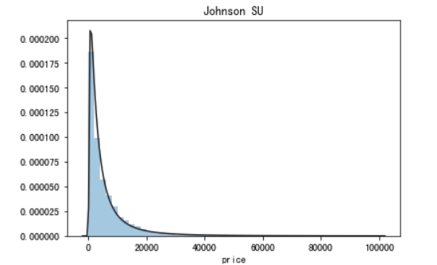
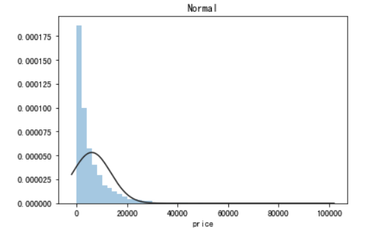
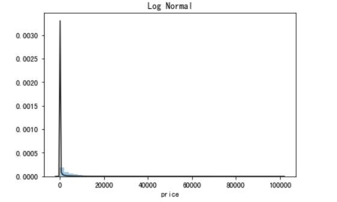

**结论**：价格不服从正态分布，所以在回归之前，必须进行转换。虽然对数变换做得很好，但**最佳拟合是无界约翰逊分布**

5.2) 查看skewness and kurtosis
```markdown
sns.distplot(Train_data['price']);
print("Skewness: %f" % Train_data['price'].skew())
print("Kurtosis: %f" % Train_data['price'].kurt())
```
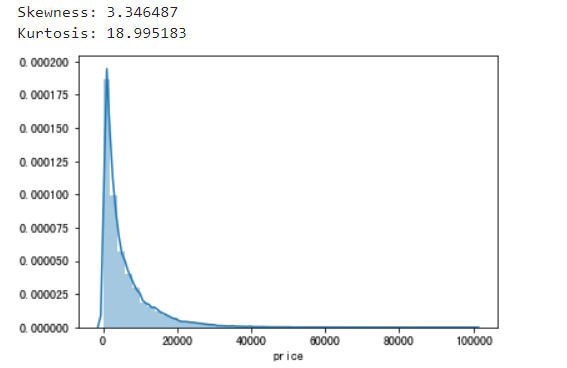

```markdown
Train_data.skew(), Train_data.kurt()

(SaleID               6.017846e-17
, name                 5.576058e-01
, regDate              2.849508e-02
, model                1.484388e+00
, brand                1.150760e+00
, bodyType             9.915299e-01
, fuelType             1.595486e+00
, gearbox              1.317514e+00
, power                6.586318e+01
, kilometer           -1.525921e+00
, notRepairedDamage    2.430640e+00
, regionCode           6.888812e-01
, creatDate           -7.901331e+01
, price                3.346487e+00
, v_0                 -1.316712e+00
, v_1                  3.594543e-01
, v_2                  4.842556e+00
, v_3                  1.062920e-01
, v_4                  3.679890e-01
, v_5                 -4.737094e+00
, v_6                  3.680730e-01
, v_7                  5.130233e+00
, v_8                  2.046133e-01
, v_9                  4.195007e-01
, v_10                 2.522046e-02
, v_11                 3.029146e+00
, v_12                 3.653576e-01
, v_13                 2.679152e-01
, v_14                -1.186355e+00
, dtype: float64, SaleID                 -1.200000
, name                   -1.039945
, regDate                -0.697308
, model                   1.740483
, brand                   1.076201
, bodyType                0.206937
, fuelType                5.880049
, gearbox                -0.264161
, power                5733.451054
, kilometer               1.141934
, notRepairedDamage       3.908072
, regionCode             -0.340832
, creatDate            6881.080328
, price                  18.995183
, v_0                     3.993841
, v_1                    -1.753017
, v_2                    23.860591
, v_3                    -0.418006
, v_4                    -0.197295
, v_5                    22.934081
, v_6                    -1.742567
, v_7                    25.845489
, v_8                    -0.636225
, v_9                    -0.321491
, v_10                   -0.577935
, v_11                   12.568731
, v_12                    0.268937
, v_13                   -0.438274
, v_14                    2.393526
, dtype: float64)
```
```markdown
sns.distplot(Train_data.skew(),color='blue',axlabel ='Skewness')
```
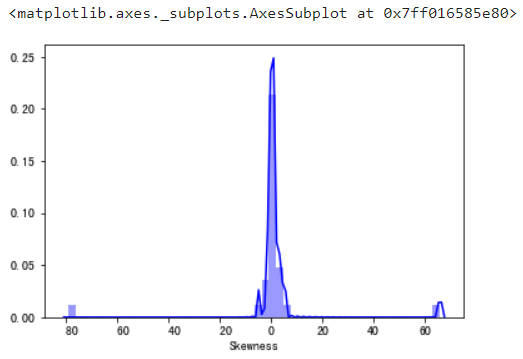

sns.distplot(Train_data.kurt(),color='orange',axlabel ='Kurtness')
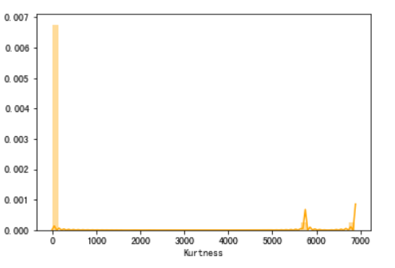

至于为啥需要衡量这两个量，参考skew、kurt说明：https://www.cnblogs.com/wyy1480/p/10474046.html

5.3) 查看预测值的具体频数
```markdown
plt.hist(Train_data['price'], orientation = 'vertical',histtype = 'bar', color ='red')
plt.show()
```
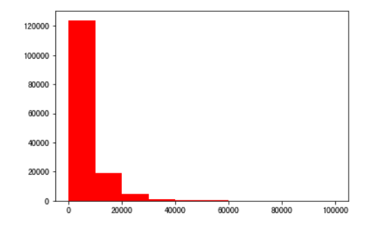

**结论**：查看频数, 大于20000得值极少，其实这一步可以在前面进行，将其当作特殊得值（异常值）直接用填充或者直接删除

log变换 z之后的分布较均匀，可以进行log变换进行预测，这也是预测问题常用的trick
```markdown
plt.hist(np.log(Train_data['price']), orientation = 'vertical',histtype = 'bar', color ='red') 
plt.show()
```
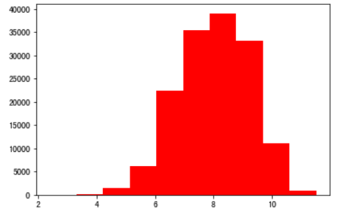

**6 特征分为类别特征和数字特征，并对类别特征查看unique分布**
```markdown
# 首先分离label即预测值
Y_train = Train_data['price']
```
```markdown
# 这个区别方式适用于没有直接label coding的数据
# 这里不适用，需要人为根据实际含义来区分
# 数字特征
# numeric_features = Train_data.select_dtypes(include=[np.number])
# numeric_features.columns
# # 类型特征
# categorical_features = Train_data.select_dtypes(include=[np.object])
# categorical_features.columns


# 手动分离出数字特征
numeric_features = ['power', 'kilometer', 'v_0', 'v_1', 'v_2', 'v_3', 'v_4', 'v_5', 'v_6', 'v_7', 'v_8', 'v_9', 'v_10', 'v_11', 'v_12', 'v_13','v_14' ]
# 手动分离出类别特征
categorical_features = ['name', 'model', 'brand', 'bodyType', 'fuelType', 'gearbox', 'notRepairedDamage', 'regionCode',]

# 数字特征nunique分布
for num_fea in numeric_features:
    print(cat_fea + "的特征分布如下：")
    print("{}特征有个{}不同的值".format(cat_fea, Train_data[num_fea].nunique()))
    print(Train_data[num_fea].value_counts())

# 特征nunique分布
for cat_fea in categorical_features:
    print(cat_fea + "的特征分布如下：")
    print("{}特征有个{}不同的值".format(cat_fea, Test_data[cat_fea].nunique()))
    print(Test_data[cat_fea].value_counts())
```

**7 数字特征分析**
```markdown
numeric_features.append('price')
numeric_features

['power',
 'kilometer',
 'v_0',
 'v_1',
 'v_2',
 'v_3',
 'v_4',
 'v_5',
 'v_6',
 'v_7',
 'v_8',
 'v_9',
 'v_10',
 'v_11',
 'v_12',
 'v_13',
 'v_14',
 'price']
```

7.1) 相关性分析
```markdown
price_numeric = Train_data[numeric_features]
correlation = price_numeric.corr()
print(correlation['price'].sort_values(ascending = False),'\n')

>>>
price        1.000000
v_12         0.692823
v_8          0.685798
v_0          0.628397
power        0.219834
v_5          0.164317
v_2          0.085322
v_6          0.068970
v_1          0.060914
v_14         0.035911
v_13        -0.013993
v_7         -0.053024
v_4         -0.147085
v_9         -0.206205
v_10        -0.246175
v_11        -0.275320
kilometer   -0.440519
v_3         -0.730946
Name: price, dtype: float64 
```

```markdown
f , ax = plt.subplots(figsize = (7, 7))
plt.title('Correlation of Numeric Features with Price',y=1,size=16)
sns.heatmap(correlation,square = True,  vmax=0.8)
```
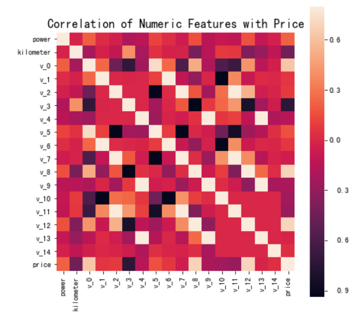

7.2) 查看几个特征得 偏度和峰值
```markdown
>>>
    for col in numeric_features:
        print('{:15}'.format(col), 
              'Skewness: {:05.2f}'.format(Train_data[col].skew()) , 
              '   ' ,
              'Kurtosis: {:06.2f}'.format(Train_data[col].kurt())  
             )

>>>
    power           Skewness: 65.86     Kurtosis: 5733.45
    kilometer       Skewness: -1.53     Kurtosis: 001.14
    v_0             Skewness: -1.32     Kurtosis: 003.99
    v_1             Skewness: 00.36     Kurtosis: -01.75
    v_2             Skewness: 04.84     Kurtosis: 023.86
    v_3             Skewness: 00.11     Kurtosis: -00.42
    v_4             Skewness: 00.37     Kurtosis: -00.20
    v_5             Skewness: -4.74     Kurtosis: 022.93
    v_6             Skewness: 00.37     Kurtosis: -01.74
    v_7             Skewness: 05.13     Kurtosis: 025.85
    v_8             Skewness: 00.20     Kurtosis: -00.64
    v_9             Skewness: 00.42     Kurtosis: -00.32
    v_10            Skewness: 00.03     Kurtosis: -00.58
    v_11            Skewness: 03.03     Kurtosis: 012.57
    v_12            Skewness: 00.37     Kurtosis: 000.27
    v_13            Skewness: 00.27     Kurtosis: -00.44
    v_14            Skewness: -1.19     Kurtosis: 002.39
    price           Skewness: 03.35     Kurtosis: 019.00
```

7.3) 每个数字特征得分布可视化
```markdown
f = pd.melt(Train_data, value_vars=numeric_features)
g = sns.FacetGrid(f, col="variable",  col_wrap=2, sharex=False, sharey=False)
g = g.map(sns.distplot, "value")
```

7.4) 数字特征相互之间的关系可视化
sns.set()
columns = ['price', 'v_12', 'v_8' , 'v_0', 'power', 'v_5',  'v_2', 'v_6', 'v_1', 'v_14']
sns.pairplot(Train_data[columns],size = 2 ,kind ='scatter',diag_kind='kde')
plt.show()

**此处是多变量之间的关系可视化，可视化更多学习可参考很不错的文章** https://www.jianshu.com/p/6e18d21a4cad

7.5) 多变量互相回归关系可视化
```markdown
fig, ((ax1, ax2), (ax3, ax4), (ax5, ax6), (ax7, ax8), (ax9, ax10)) = plt.subplots(nrows=5, ncols=2, figsize=(24, 20))
# ['v_12', 'v_8' , 'v_0', 'power', 'v_5',  'v_2', 'v_6', 'v_1', 'v_14']
v_12_scatter_plot = pd.concat([Y_train,Train_data['v_12']],axis = 1)
sns.regplot(x='v_12',y = 'price', data = v_12_scatter_plot,scatter= True, fit_reg=True, ax=ax1)

v_8_scatter_plot = pd.concat([Y_train,Train_data['v_8']],axis = 1)
sns.regplot(x='v_8',y = 'price',data = v_8_scatter_plot,scatter= True, fit_reg=True, ax=ax2)

v_0_scatter_plot = pd.concat([Y_train,Train_data['v_0']],axis = 1)
sns.regplot(x='v_0',y = 'price',data = v_0_scatter_plot,scatter= True, fit_reg=True, ax=ax3)

power_scatter_plot = pd.concat([Y_train,Train_data['power']],axis = 1)
sns.regplot(x='power',y = 'price',data = power_scatter_plot,scatter= True, fit_reg=True, ax=ax4)

v_5_scatter_plot = pd.concat([Y_train,Train_data['v_5']],axis = 1)
sns.regplot(x='v_5',y = 'price',data = v_5_scatter_plot,scatter= True, fit_reg=True, ax=ax5)

v_2_scatter_plot = pd.concat([Y_train,Train_data['v_2']],axis = 1)
sns.regplot(x='v_2',y = 'price',data = v_2_scatter_plot,scatter= True, fit_reg=True, ax=ax6)

v_6_scatter_plot = pd.concat([Y_train,Train_data['v_6']],axis = 1)
sns.regplot(x='v_6',y = 'price',data = v_6_scatter_plot,scatter= True, fit_reg=True, ax=ax7)

v_1_scatter_plot = pd.concat([Y_train,Train_data['v_1']],axis = 1)
sns.regplot(x='v_1',y = 'price',data = v_1_scatter_plot,scatter= True, fit_reg=True, ax=ax8)

v_14_scatter_plot = pd.concat([Y_train,Train_data['v_14']],axis = 1)
sns.regplot(x='v_14',y = 'price',data = v_14_scatter_plot,scatter= True, fit_reg=True, ax=ax9)

v_13_scatter_plot = pd.concat([Y_train,Train_data['v_13']],axis = 1)
sns.regplot(x='v_13',y = 'price',data = v_13_scatter_plot,scatter= True, fit_reg=True, ax=ax10)
```
**8 类别特征分析**

8.1) unique分布
```markdown
>>>
    for fea in categorical_features:
        print(Train_data[fea].nunique())

>>>
    99662
    248
    40
    8
    7
    2
    2
    7905
```
8.2) 类别特征箱形图可视化
```markdown
# 因为name和regionCode的类别太稀疏了，这里我们把不稀疏的几类画一下
categorical_features = ['model',
 'brand',
 'bodyType',
 'fuelType',
 'gearbox',
 'notRepairedDamage']
for c in categorical_features:
    Train_data[c] = Train_data[c].astype('category')
    if Train_data[c].isnull().any():
        Train_data[c] = Train_data[c].cat.add_categories(['MISSING'])
        Train_data[c] = Train_data[c].fillna('MISSING')

def boxplot(x, y, **kwargs):
    sns.boxplot(x=x, y=y)
    x=plt.xticks(rotation=90)

f = pd.melt(Train_data, id_vars=['price'], value_vars=categorical_features)
g = sns.FacetGrid(f, col="variable",  col_wrap=2, sharex=False, sharey=False, size=5)
g = g.map(boxplot, "value", "price")
```
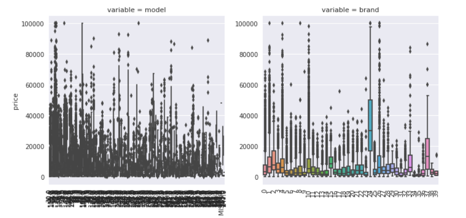
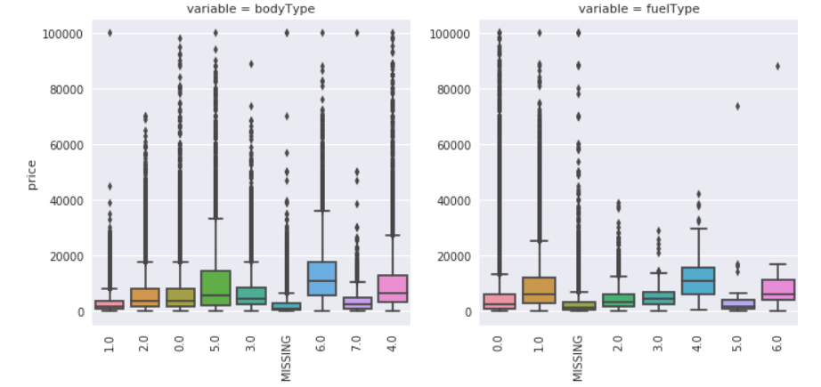
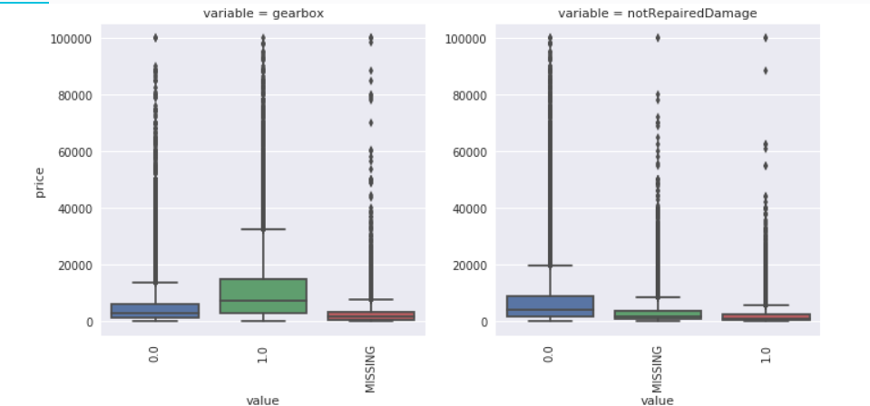

8.3) 类别特征的小提琴图可视化
```markdown
catg_list = categorical_features
target = 'price'
for catg in catg_list :
    sns.violinplot(x=catg, y=target, data=Train_data)
    plt.show()
```


 
8.4) 类别特征的柱形图可视化
```markdown
def bar_plot(x, y, **kwargs):
    sns.barplot(x=x, y=y)
    x=plt.xticks(rotation=90)
    
categorical_features = ['model',
 'brand',
 'bodyType',
 'fuelType',
 'gearbox',
 'notRepairedDamage']

f = pd.melt(Train_data, id_vars=['price'], value_vars=categorical_features)
g = sns.FacetGrid(f, col="variable",  col_wrap=2, sharex=False, sharey=False, size=5)
g = g.map(bar_plot, "value", "price")
```

8.5) 类别特征的每个类别频数可视化(count_plot)
```markdown
def count_plot(x,  **kwargs):
    sns.countplot(x=x)
    x=plt.xticks(rotation=90)

f = pd.melt(Train_data,  value_vars=categorical_features)
g = sns.FacetGrid(f, col="variable",  col_wrap=2, sharex=False, sharey=False, size=5)
g = g.map(count_plot, "value")

```

**9 用pandas_profiling生成数据报告**

用pandas_profiling生成一个较为全面的可视化和数据报告(较为简单、方便) 最终打开html文件即可
```markdown
import pandas_profiling
pfr = pandas_profiling.ProfileReport(Train_data)
pfr.to_file("./example.html")

```
### 经验总结
所给出的EDA步骤为广为普遍的步骤，在实际的不管是工程还是比赛过程中，这只是最开始的一步，也是最基本的一步。

接下来一般要结合模型的效果以及特征工程等来分析数据的实际建模情况，根据自己的一些理解，查阅文献，对实际问题做出判断和深入的理解。

最后不断进行EDA与数据处理和挖掘，来到达更好的数据结构和分布以及较为强势相关的特征


数据探索在机器学习中我们一般称为EDA（Exploratory Data Analysis）,是指对已有的数据（特别是调查或观察得来的原始数据）在尽量少的先验假定下进行探索，
**通过作图、制表、方程拟合、计算特征量等手段探索数据的结构和规律的一种数据分析方法**。

**意义**：数据探索有利于我们发现数据的一些特性，数据之间的关联性，对于后续的特征构建是很有帮助的。

1. 对于数据的初步分析（直接查看数据，或.sum(), .mean()，.descirbe()等统计函数）可以从：</br>
    样本数量，训练集数量，是否有时间特征，是否是时序问题，特征所表示的含义（非匿名特征），特征类型（字符类似，int，float，time），特征的缺失情况（注意缺失的在数据中的表现形式，有些是空的有些是”NAN”符号等），特征的均值方差情况。
2. 分析记录某些**特征值缺失占比30%以上样本**的缺失处理，有助于后续的模型验证和调节，分析特征应该是：</br>
    1.填充（填充方式是什么，均值填充，0填充，众数填充等）</br>
    2.舍去</br>
    3.先做样本分类用不同的特征模型去预测。</br>
3. **对于异常值做专门的分析**，</br>
    1.分析特征异常的label是否为异常值（或者偏离均值较远或者事特殊符号）,</br>
    2.异常值是否应该剔除，还是用正常值填充</br>
    3.是记录异常，还是机器本身异常等。</br>
4. **对于Label做专门的分析**，分析标签的分布情况等。</br>
    进一步分析可以通过对特征作图，特征和label联合做图（统计图，离散图），直观了解特征的分布情况，</br>
    通过这一步也可以发现数据之中的一些异常值等；</br>
    通过箱型图分析一些特征值的偏离情况；</br>
    对于特征和特征联合作图，对于特征和label联合作图，分析其中的一些关联性。</br>

