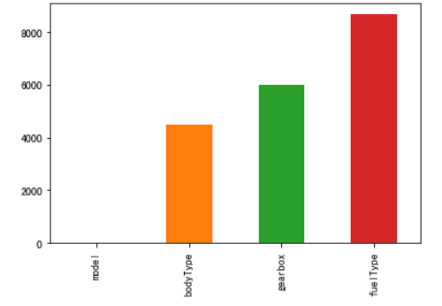

## 1. EDA 目标 (Exploratory Data Analysis)

1.EDA的价值主要在于熟悉数据集，**了解数据集**，对数据集进行验证来确定所获得数据集可以用于接下来的机器学习或者深度学习使用。

2.当了解了数据集之后我们下一步就是要去**了解变量间的相互关系以及变量与预测值之间的存在关系**。

3.**引导数据科学从业者进行数据处理以及特征工程**的步骤,使数据集的结构和特征集**让接下来的预测问题更加可靠**。

## 2. 内容及步骤
   
```
1.载入各种数据科学以及可视化库:
   数据科学库 pandas、numpy、scipy；
   可视化库 matplotlib、seabon；
   其他；
2.载入数据：
   载入训练集和测试集；
   简略观察数据(head()+shape)；
3.数据总览:
   通过 describe()来熟悉数据的相关统计量
   通过 info()来熟悉数据类型
4.判断数据缺失和异常
   查看每列的存在 nan 情况
   异常值检测
5.了解预测值的分布
   总体分布概况（无界约翰逊分布等）
   查看 skewness and kurtosis
   查看预测值的具体频数
6.特征分为类别特征和数字特征，并对类别特征查看 unique 分布
7.数字特征分析
   相关性分析
   查看几个特征得 偏度和峰值
   每个数字特征得分布可视化
   数字特征相互之间的关系可视化
   多变量互相回归关系可视化
8.类型特征分析
   unique 分布
   类别特征箱形图可视化
   类别特征的小提琴图可视化
   类别特征的柱形图可视化类别
   特征的每个类别频数可视化(count_plot)
9.用 pandas_profiling 生成数据报告
```

## 3. 代码实战
**1 载入包和数据**

```
# 载入各种数据科学以及可视化库
#coding:utf-8 #导入 warnings 包，利用过滤器来实现忽略警告语句。
import warnings
warnings.filterwarnings('ignore')

import pandas as pd
import numpy as np
import matplotlib.pyplot as plt
import seaborn as sns
import missingno as msno
```


```
# 载入数据
载入训练集和测试集；
path = './datalab/231784/'
Train_data = pd.read_csv(path+'used_car_train_20200313.csv', sep=' ')
Test_data = pd.read_csv(path+'used_car_testA_20200313.csv', sep=' ')

所有特征集均脱敏处理(方便大家观看)
name - 汽车编码
regDate - 汽车注册时间
model - 车型编码
brand - 品牌
bodyType - 车身类型
fuelType - 燃油类型
gearbox - 变速箱
power - 汽车功率
kilometer - 汽车行驶公里
notRepairedDamage - 汽车有尚未修复的损坏
regionCode - 看车地区编码
seller - 销售方
offerType - 报价类型
creatDate - 广告发布时间
price - 汽车价格
v_0', 'v_1', 'v_2', 'v_3', 'v_4', 'v_5', 'v_6', 'v_7', 'v_8', 'v_9', 'v_10', 'v_11', 'v_12', 'v_13','v_14' 【匿名特征，包含 v0-14 在内 15 个匿名特征】
```


**2. 简略观察数据(head()+shape)**
   
```
Train_data.head().append(Train_data.tail())
```

| SaleID | name   | regDate | model    | brand | bodyType | fuelType | gearbox | power | kilometer | ...  | v_5 | v_6      | v_7      | v_8      | v_9      | v_10     | v_11      | v_12      | v_13      | v_14      |
| ------ | ------ | ------- | -------- | ----- | -------- | -------- | ------- | ----- | --------- | ---- | --- | -------- | -------- | -------- | -------- | -------- | --------- | --------- | --------- | --------- |
| 0      | 0      | 736     | 20040402 | 30.0  | 6        | 1.0      | 0.0     | 0.0   | 60        | 12.5 | ... | 0.235676 | 0.101988 | 0.129549 | 0.022816 | 0.097462 | -2.881803 | 2.804097  | -2.420821 | 0.795292  |
| 1      | 1      | 2262    | 20030301 | 40.0  | 1        | 2.0      | 0.0     | 0.0   | 0         | 15.0 | ... | 0.264777 | 0.121004 | 0.135731 | 0.026597 | 0.020582 | -4.900482 | 2.096338  | -1.030483 | -1.722674 |
| 2      | 2      | 14874   | 20040403 | 115.0 | 15       | 1.0      | 0.0     | 0.0   | 163       | 12.5 | ... | 0.251410 | 0.114912 | 0.165147 | 0.062173 | 0.027075 | -4.846749 | 1.803559  | 1.565330  | -0.832687 |
| 3      | 3      | 71865   | 19960908 | 109.0 | 10       | 0.0      | 0.0     | 1.0   | 193       | 15.0 | ... | 0.274293 | 0.110300 | 0.121964 | 0.033395 | 0.000000 | -4.509599 | 1.285940  | -0.501868 | -2.438353 |
| 4      | 4      | 111080  | 20120103 | 110.0 | 5        | 1.0      | 0.0     | 0.0   | 68        | 5.0  | ... | 0.228036 | 0.073205 | 0.091880 | 0.078819 | 0.121534 | -1.896240 | 0.910783  | 0.931110  | 2.834518  |
| 149995 | 149995 | 163978  | 20000607 | 121.0 | 10       | 4.0      | 0.0     | 1.0   | 163       | 15.0 | ... | 0.280264 | 0.000310 | 0.048441 | 0.071158 | 0.019174 | 1.988114  | -2.983973 | 0.589167  | -1.304370 |
| 149996 | 149996 | 184535  | 20091102 | 116.0 | 11       | 0.0      | 0.0     | 0.0   | 125       | 10.0 | ... | 0.253217 | 0.000777 | 0.084079 | 0.099681 | 0.079371 | 1.839166  | -2.774615 | 2.553994  | 0.924196  |
| 149997 | 149997 | 147587  | 20101003 | 60.0  | 11       | 1.0      | 1.0     | 0.0   | 90        | 6.0  | ... | 0.233353 | 0.000705 | 0.118872 | 0.100118 | 0.097914 | 2.439812  | -1.630677 | 2.290197  | 1.891922  |
| 149998 | 149998 | 45907   | 20060312 | 34.0  | 10       | 3.0      | 1.0     | 0.0   | 156       | 15.0 | ... | 0.256369 | 0.000252 | 0.081479 | 0.083558 | 0.081498 | 2.075380  | -2.633719 | 1.414937  | 0.431981  |
| 149999 | 149999 | 177672  | 19990204 | 19.0  | 28       | 6.0      | 0.0     | 1.0   | 193       | 12.5 | ... | 0.284475 | 0.000000 | 0.040072 | 0.062543 | 0.025819 | 1.978453  | -3.179913 | 0.031724  | -1.483350 |
|        |        |         |          |       |          |          |         |       |           |      |     |          |          |          |          |          |           |           |           |           |

**目标**：要养成看数据集的 head()以及 shape 的习惯，这会让你每一步更放心，导致接下里的连串的错误, 如果对自己的 pandas 等操作不放心，建议执行一步看一下，这样会有效的方便你进行理解函数并进行操作<br>
  
**3. 总览数据概况(describe，info）**

   describe 中有每列的统计量，个数 count、平均值 mean、方差 std、最小值 min、中位数 25% 50% 75% 以及最大值 看这个信息主要是瞬间掌握数据的大概的范围以及每个值的异常值的判断，比如有的时候会发现 999 9999 -1 等值这些其实都是 nan 的另外一种表达方式，有的时候需要注意下<br>
   
   info 通过 info 来了解数据每列的 type，有助于了解是否存在除了 nan 以外的特殊符号异常
   
**3.1) 通过 .describe()来熟悉数据的相关统计量**

```
   Train_data.describe()
```

|          | SaleID        | name          | regDate      | model         | brand         | bodyType      | fuelType      | gearbox       | power         | kilometer     | ... | v_5           | v_6           | v_7           | v_8           | v_9           | v_10          | v_11          | v_12          | v_13          | v_14          |
| ----- | ------------- | ------------- | ------------ | ------------- | ------------- | ------------- | ------------- | ------------- | ------------- | ------------- | --- | ------------- | ------------- | ------------- | ------------- | ------------- | ------------- | ------------- | ------------- | ------------- | ------------- |
| count | 150000.000000 | 150000.000000 | 1.500000e+05 | 149999.000000 | 150000.000000 | 145494.000000 | 141320.000000 | 144019.000000 | 150000.000000 | 150000.000000 | ... | 150000.000000 | 150000.000000 | 150000.000000 | 150000.000000 | 150000.000000 | 150000.000000 | 150000.000000 | 150000.000000 | 150000.000000 | 150000.000000 |
| mean  | 74999.500000  | 68349.172873  | 2.003417e+07 | 47.129021     | 8.052733      | 1.792369      | 0.375842      | 0.224943      | 119.316547    | 12.597160     | ... | 0.248204      | 0.044923      | 0.124692      | 0.058144      | 0.061996      | -0.001000     | 0.009035      | 0.004813      | 0.000313      | -0.000688     |
| std   | 43301.414527  | 61103.875095  | 5.364988e+04 | 49.536040     | 7.864956      | 1.760640      | 0.548677      | 0.417546      | 177.168419    | 3.919576      | ... | 0.045804      | 0.051743      | 0.201410      | 0.029186      | 0.035692      | 3.772386      | 3.286071      | 2.517478      | 1.288988      | 1.038685      |
| min   | 0.000000      | 0.000000      | 1.991000e+07 | 0.000000      | 0.000000      | 0.000000      | 0.000000      | 0.000000      | 0.000000      | 0.500000      | ... | 0.000000      | 0.000000      | 0.000000      | 0.000000      | 0.000000      | -9.168192     | -5.558207     | -9.639552     | -4.153899     | -6.546556     |
| 25%   | 37499.750000  | 11156.000000  | 1.999091e+07 | 10.000000     | 1.000000      | 0.000000      | 0.000000      | 0.000000      | 75.000000     | 12.500000     | ... | 0.243615      | 0.000038      | 0.062474      | 0.035334      | 0.033930      | -3.722303     | -1.951543     | -1.871846     | -1.057789     | -0.437034     |
| 50%   | 74999.500000  | 51638.000000  | 2.003091e+07 | 30.000000     | 6.000000      | 1.000000      | 0.000000      | 0.000000      | 110.000000    | 15.000000     | ... | 0.257798      | 0.000812      | 0.095866      | 0.057014      | 0.058484      | 1.624076      | -0.358053     | -0.130753     | -0.036245     | 0.141246      |
| 75%   | 112499.250000 | 118841.250000 | 2.007111e+07 | 66.000000     | 13.000000     | 3.000000      | 1.000000      | 0.000000      | 150.000000    | 15.000000     | ... | 0.265297      | 0.102009      | 0.125243      | 0.079382      | 0.087491      | 2.844357      | 1.255022      | 1.776933      | 0.942813      | 0.680378      |
| max   | 149999.000000 | 196812.000000 | 2.015121e+07 | 247.000000    | 39.000000     | 7.000000      | 6.000000      | 1.000000      | 19312.000000  | 15.000000     | ... | 0.291838      | 0.151420      | 1.404936      | 0.160791      | 0.222787      | 12.357011     | 18.819042     | 13.847792     | 11.147669     | 8.658418      |
|       | SaleID        | name          | regDate      | model         | brand         | bodyType      | fuelType      | gearbox       | power         | kilometer     | ... | v_5           | v_6           | v_7           | v_8           | v_9           | v_10          | v_11          | v_12          | v_13          | v_14          |
| count | 150000.000000 | 150000.000000 | 1.500000e+05 | 149999.000000 | 150000.000000 | 145494.000000 | 141320.000000 | 144019.000000 | 150000.000000 | 150000.000000 | ... | 150000.000000 | 150000.000000 | 150000.000000 | 150000.000000 | 150000.000000 | 150000.000000 | 150000.000000 | 150000.000000 | 150000.000000 | 150000.000000 |
| mean  | 74999.500000  | 68349.172873  | 2.003417e+07 | 47.129021     | 8.052733      | 1.792369      | 0.375842      | 0.224943      | 119.316547    | 12.597160     | ... | 0.248204      | 0.044923      | 0.124692      | 0.058144      | 0.061996      | -0.001000     | 0.009035      | 0.004813      | 0.000313      | -0.000688     |
 
 
**3.2) 通过 .info() 简要可以看到对应一些数据列名，以及 NAN 缺失信息**

```
   Train_data.info()
```

```
   <class 'pandas.core.frame.DataFrame'>
   RangeIndex: 150000 entries, 0 to 149999
   Data columns (total 31 columns):
   SaleID 150000 non-null int64
   name 150000 non-null int64
   regDate 150000 non-null int64
   model 149999 non-null float64
   brand 150000 non-null int64
   bodyType 145494 non-null float64
   fuelType 141320 non-null float64
   gearbox 144019 non-null float64
   power 150000 non-null int64
   kilometer 150000 non-null float64
   notRepairedDamage 150000 non-null object
   regionCode 150000 non-null int64
   seller 150000 non-null int64
   offerType 150000 non-null int64
   creatDate 150000 non-null int64
   price 150000 non-null int64
   v_0 150000 non-null float64
   v_1 150000 non-null float64
   v_2 150000 non-null float64
   v_3 150000 non-null float64
   v_4 150000 non-null float64
   v_5 150000 non-null float64
   v_6 150000 non-null float64
   v_7 150000 non-null float64
   v_8 150000 non-null float64
   v_9 150000 non-null float64
   v_10 150000 non-null float64
   v_11 150000 non-null float64
   v_12 150000 non-null float64
   v_13 150000 non-null float64
   v_14 150000 non-null float64
   dtypes: float64(20), int64(10), object(1)
   memory usage: 35.5+ MB
```
   
   
**3.3) 判断数据缺失和异常**
3.3.1查看每列的存在nan情况

```
Train_data.isnull().sum()
```
```
SaleID                  0
name                    0
regDate                 0
model                   1
brand                   0
bodyType             4506
fuelType             8680
gearbox              5981
power                   0
kilometer               0
notRepairedDamage       0
regionCode              0
seller                  0
offerType               0
creatDate               0
price                   0
v_0                     0
v_1                     0
v_2                     0
v_3                     0
v_4                     0
v_5                     0
v_6                     0
v_7                     0
v_8                     0
v_9                     0
v_10                    0
v_11                    0
v_12                    0
v_13                    0
v_14                    0
dtype: int64
```

```
Test_data.isnull().sum()
```
```
SaleID                  0
name                    0
regDate                 0
model                   0
brand                   0
bodyType             1413
fuelType             2893
gearbox              1910
power                   0
kilometer               0
notRepairedDamage       0
regionCode              0
seller                  0
offerType               0
creatDate               0
v_0                     0
v_1                     0
v_2                     0
v_3                     0
v_4                     0
v_5                     0
v_6                     0
v_7                     0
v_8                     0
v_9                     0
v_10                    0
v_11                    0
v_12                    0
v_13                    0
v_14                    0
dtype: int64
```

```
# nan可视化
missing = Train_data.isnull().sum()
missing = missing[missing > 0]
missing.sort_values(inplace=True)
missing.plot.bar()
```



通过以上两句可以很直观的了解哪些列存在 “nan”, 并可以把nan的个数打印.

主要的目的在于 nan存在的个数是否真的很大:
**如果很小一般选择填充，如果使用lgb等树模型可以直接空缺，让树自己去优化，但如果nan存在的过多、可以考虑删掉**

